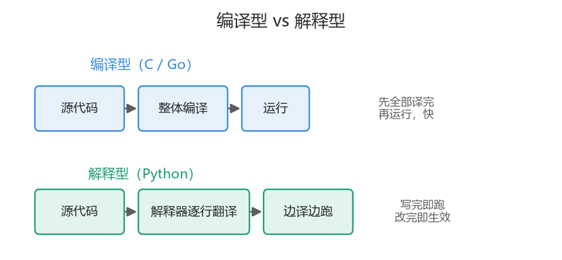
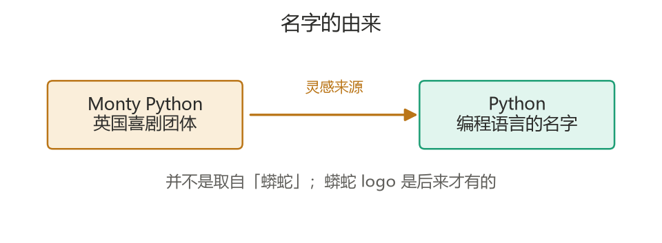
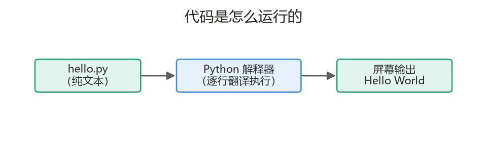
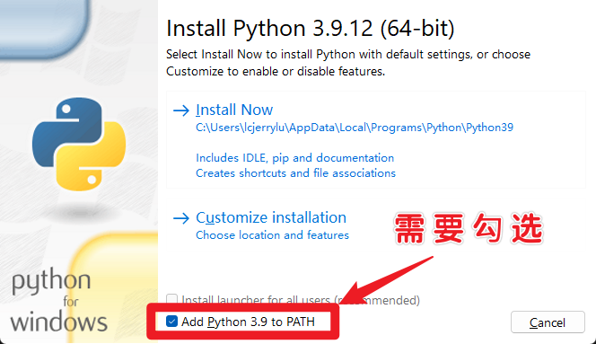
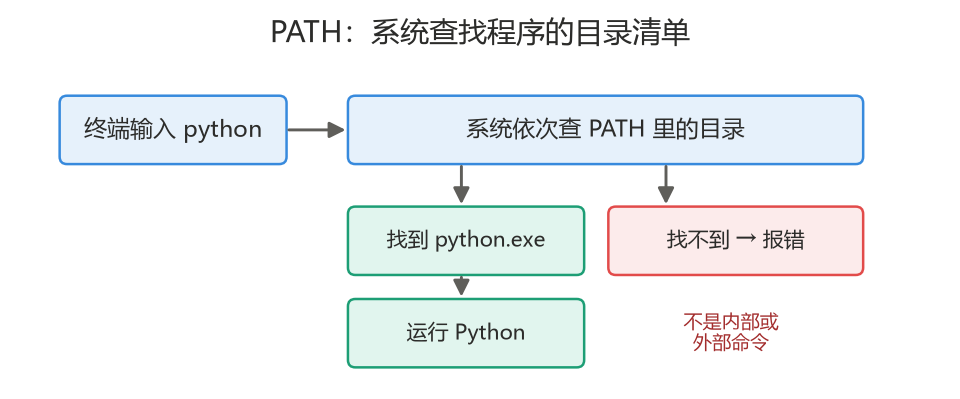
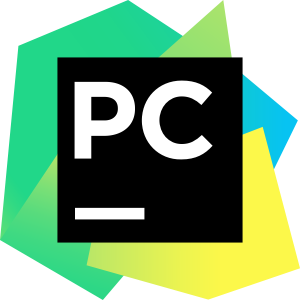
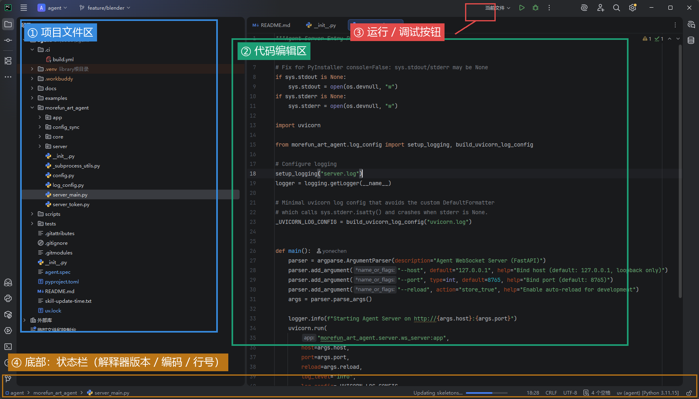

<a id="top"></a>

# Section 1　入门 + 环境搭建 + 语法初体验

> 本节从「编程是什么」讲起，完成 Python 环境的安装与配置，最后写出并运行第一个程序。

---

## 本节导航

**第一部分　编程认知**

| 序号 | 主题                           |
| :--: | :----------------------------- |
| 1.1  | [什么是编程语言](#s11)         |
| 1.2  | [编译型 vs 解释型](#s12)       |
| 1.3  | [Python 的历史与由来](#s13)    |
| 1.4  | [Python 2 还是 Python 3](#s14) |
| 1.5  | [Python 能做什么](#s15)        |
| 1.6  | [为什么 Python 好学](#s16)     |
| 1.7  | [代码是怎么运行的](#s17)       |

**第二部分　环境搭建**

| 序号 | 主题                                 |
| :--: | :----------------------------------- |
| 1.8  | [安装 Python 与 PATH 环境变量](#s18) |
| 1.9  | [终端 / 命令行入门](#s19)            |
| 1.10 | [Python 解释器与交互模式](#s110)     |
| 1.11 | [开发环境 PyCharm](#s111)            |
| 1.12 | [包管理 pip 与虚拟环境 venv](#s112)  |

**第三部分　语法初体验**

| 序号 | 主题                          |
| :--: | :---------------------------- |
| 1.13 | [第一个程序与基本语法](#s113) |
|  —   | [本节小结](#summary)          |

---

<a id="s11"></a>

## 1.1　什么是编程语言

**编程，就是人给计算机下达指令。**

计算机只认识 **0 和 1**（对应电路的低电平和高电平），不会思考、不会变通，只会一步步照做指令。而人无法直接写 0 和 1，因此有了**编程语言**——一套「计算机能执行、人也写得出」的规则，充当人与机器之间的翻译。

```
     人                 编程语言              计算机
  想让电脑做事   ──►   Python / Java / C   ──►   只懂 0 和 1
```

三个基本概念：

| 概念           | 含义                                         |
| :------------- | :------------------------------------------- |
| 代码 (code)    | 写下的一段指令                               |
| 程序 (program) | 一个能完成任务的代码文件                     |
| 编程语言       | Python、Java、C、JavaScript 等，各有擅长场景 |

指令的特点：必须写得足够具体、完整。计算机不会自行补全遗漏的步骤，缺一步就会出错或停下。

<sub>[返回目录](#top)</sub>

---

<a id="s12"></a>

## 1.2　编译型 vs 解释型

代码是人写的，机器需要先把它「翻译」成能执行的形式。翻译方式分两种：

| 方式   | 代表语言                | 翻译方式                                             | 特点                                     |
| :----- | :---------------------- | :--------------------------------------------------- | :--------------------------------------- |
| 编译型 | C / C++ / Go            | 先把整段代码一次性译成机器码，生成可执行文件，再运行 | 运行快，但改动后需重新编译               |
| 解释型 | **Python** / JavaScript | 由**解释器**一行行边翻译边执行                       | 写完即可运行、改完即生效，运行速度(稍)慢 |



**Python 属于解释型语言，运行它需要一个「解释器」。** 这也是学习 Python 的第一步——先在电脑上安装解释器（下一节内容）。

关于运行速度：Python 比 C 慢，但它的优势是开发快、易上手；对数据处理、后端、脚本等绝大多数场景，速度差异并不影响使用；确有性能瓶颈时也有专门的优化手段。

<sub>[返回目录](#top)</sub>

---

<a id="s13"></a>

## 1.3　Python 的历史与由来


- **1989 年圣诞节**，荷兰程序员 **Guido van Rossum**（吉多）开始设计 Python，**1991 年**正式发布。
- 吉多曾被称为 Python 社区的「仁慈的独裁者（BDFL）：是少数开源软件开发者所拥有的头衔。他们通常是某一项目的创始人，并在该项目社区出现争议时拥有最终的决定权。」。
- 先后在 Google、Dropbox 工作。目前就职于微软开发部门（2020入职）。


<sub>Guido van Rossum（摄于 PyCon US 2024）。作者：Kushal Das，Wikimedia Commons，[CC BY-SA 4.0](https://creativecommons.org/licenses/by-sa/4.0/)，裁剪自原图。</sub>

- 名字并非来自「蟒蛇」，而是取自英国喜剧团体 _Monty Python_（蒙提·派森）。蟒蛇 logo 是后来才有的。




<sub>Monty Python 六位成员（1978 年）。图片来源：Wikimedia Commons，公有领域（PD-US-1978-89）。</sub>

Python 的设计哲学，直接决定了它的风格：

| 哲学                         | 含义                  |
| :--------------------------- | :-------------------- |
| Life is short, use Python    | 人生苦短，我用 Python |
| 代码是给人读的               | 强调代码整洁、可读    |
| 一种、最好只有一种明显的做法 | 减少写法上的选择困难  |

正因为追求「好读好写」，Python 特别适合零基础入门。

<sub>[返回目录](#top)</sub>

---

<a id="s14"></a>

## 1.4　Python 2 还是 Python 3

Python 有两大版本，语法有差异、不完全兼容：

|   版本   | 状态                                             | 是否学习 |
| :------: | :----------------------------------------------- | :------: |
| Python 2 | 已于 **2020 年 1 月 1 日**停止维护，官方不再更新 |    否    |
| Python 3 | 官方主推、持续更新                               |    是    |

**结论：只学 Python 3。**

一个快速识别老代码的方法——`print` 的写法：

```python
# Python 2 的写法（已过时）
print "hello"

# Python 3 的写法
print("hello")
```

`print` 后面不带括号的，是过时的 Python 2 代码。自己上网查资料时，遇到这类写法应跳过或更换教程。

<sub>[返回目录](#top)</sub>

---

<a id="s15"></a>

## 1.5　Python 能做什么

Python 的主要应用领域：

| 领域                  | 说明                                              |
| :-------------------- | :------------------------------------------------ |
| Web 后端              | 知乎、B 站、Instagram 等的后台服务大量使用 Python |
| 数据分析 / 办公自动化 | 几行代码即可把上万行 Excel 自动汇总成报表         |
| AI / 大模型           | 绝大多数 AI 模型的训练与调用都用 Python           |
| 爬虫                  | 自动从网页抓取信息并存成表格                      |
| 自动化脚本            | 定时重命名文件、发邮件、备份、生成日报等          |
| 游戏 / 小工具         | 也可以做，但不是本课程重点                        |

<sub>[返回目录](#top)</sub>

---

<a id="s16"></a>

## 1.6　为什么 Python 好学

|  #  | 原因             | 说明                                                         |
| :-: | :--------------- | :----------------------------------------------------------- |
|  1  | 语法接近英语     | 如 `if x > 0: print("正数")`，几乎能直接读懂，不需背大量符号 |
|  2  | 不需处理底层琐事 | 不用手动管理内存地址、不写大量样板代码                       |
|  3  | 库特别多         | 多数需求已有现成工具包，`pip install` 即可使用               |
|  4  | 社区大、资料多   | 遇到报错，多数能搜到解决方案                                 |
|  5  | 招聘需求高       | 数据、后端、AI、运营分析等岗位普遍需要                       |

「库多」意味着可以复用已有成果：做数据处理有现成的数据分析库，做网站有现成的 Web 框架，无需从零编写。

<sub>[返回目录](#top)</sub>

---

<a id="s17"></a>

## 1.7　代码是怎么运行的



- `.py` 文件本质是**纯文本**，计算机无法直接读懂。
- **Python 解释器**读取代码，逐行翻译成机器能执行的操作，并产出结果。
- 因此，运行代码的前提是电脑里已安装解释器。

本节逻辑串联：

```
编程语言(1.1)  →  以解释方式运行(1.2)  →  依靠解释器(1.7)
```

下一节内容：在自己的电脑上安装 Python 解释器。

<sub>[返回目录](#top)</sub>

---

<a id="s18"></a>

## 1.8　安装 Python 与 PATH 环境变量

### 1.8.1　下载与安装

从 Python 官网 <https://www.python.org> 的 Downloads 页面下载最新的 Python 3 安装包。Windows 和 macOS 步骤略有不同，但有一个关键点两者共通。

**Windows 安装的关键一步：勾选「Add python.exe to PATH」。**  


安装向导的第一个界面底部有一个复选框「Add python.exe to PATH」，**必须勾选**再点安装。忘记勾选会导致终端里输入 `python` 时提示「不是内部或外部命令」。

macOS 使用官网 `.pkg` 安装包时会自动配置好路径，一般无需额外操作。

### 1.8.2　什么是 PATH 环境变量

PATH 是操作系统里的一份「**可执行程序的查找目录清单**」。当你在终端输入一个命令（如 `python`）时，系统并不会搜遍整个硬盘，而是**依次到 PATH 列出的目录里找**同名程序，找到就运行，找不到就报错。



「Add to PATH」做的事，就是把 Python 的安装目录加进这份清单，这样在任何位置的终端里都能直接使用 `python`。

### 1.8.3　验证安装

打开终端，输入：

```bash
python --version
```

若输出类似 `Python 3.13.x` 的版本号，说明安装成功、PATH 也配置正确。

> 注意：部分系统上命令是 `python3`（尤其 macOS）。如果 `python` 无效，试 `python3 --version`。

<sub>[返回目录](#top)</sub>

---

<a id="s19"></a>

## 1.9　终端 / 命令行入门

**终端（也叫命令行、命令提示符、Terminal）是一个用文字输入命令来操作电脑的窗口。** 很多开发工作（运行程序、装包、用 Git）都要在终端里进行，是必须掌握的基础。

打开方式：

- Windows：开始菜单搜索「PowerShell」或「命令提示符（cmd）」。
- macOS：启动台或聚焦搜索里找「终端 / Terminal」。

### 1.9.1　最常用的几个命令

| 命令                                  | 作用                               | 示例         |
| :------------------------------------ | :--------------------------------- | :----------- |
| `cd`                                  | 进入某个文件夹（change directory） | `cd Desktop` |
| `cd ..`                               | 返回上一级文件夹                   | `cd ..`      |
| `dir`（Windows）/ `ls`（macOS/Linux） | 列出当前文件夹里的文件             | `dir`        |
| `pwd`（macOS/Linux）                  | 查看当前所在位置                   | `pwd`        |
| `cls`（Windows）/ `clear`（macOS）    | 清屏                               | `cls`        |

### 1.9.2　用终端运行一个 Python 脚本

假设桌面有一个 `hello.py` 文件，运行步骤：

```bash
cd Desktop          # 先进入文件所在的文件夹
python hello.py     # 再运行它
```

理解要点：**运行脚本前，先用 `cd` 切换到脚本所在的目录**，否则系统找不到这个文件。这是初学者最常见的卡点。

<sub>[返回目录](#top)</sub>

---

<a id="s110"></a>

## 1.10　Python 解释器与交互模式

在终端里直接输入 `python`（不带文件名）并回车，会进入 Python 的**交互模式**：

```
$ python
Python 3.13.x ...
>>>
```

出现 `>>>` 提示符，表示进入了交互模式。此时可以逐行输入代码，回车后**立即执行并显示结果**：

```python
>>> print("hello")
hello
```

交互模式适合快速试验一小段代码、验证某个语法。

**退出交互模式**：输入 `exit()` 并回车，或按快捷键 `Ctrl + Z` 再回车（Windows）/ `Ctrl + D`（macOS）。

> 配套代码：[04_interactive_demo.py](../../code/part1_python/04_interactive_demo.py)

两种运行方式的区别：

| 方式                         | 特点                             | 适用场景           |
| :--------------------------- | :------------------------------- | :----------------- |
| 交互模式（`>>>`）            | 逐行输入、立即出结果，代码不保存 | 快速试验、验证语法 |
| 运行脚本（`python 文件.py`） | 执行整个文件，代码可保存复用     | 编写正式程序       |

<sub>[返回目录](#top)</sub>

---

<a id="s111"></a>

## 1.11　开发环境 PyCharm



交互模式和记事本都能写代码，但正式开发需要一个更趁手的工具——**IDE（集成开发环境）**。IDE 集成了代码编辑、语法高亮、自动补全、错误提示、一键运行、断点调试等功能。本课程使用 **PyCharm**。

### 1.11.1　PyCharm 与 VS Code

业界两款主流工具：

| 工具        | 特点                                                                                     |
| :---------- | :--------------------------------------------------------------------------------------- |
| **PyCharm** | 专为 Python 设计，能自动识别解释器、自动创建虚拟环境、图形化安装包，对新手友好、开箱即用 |
| **VS Code** | 更轻量、更通用（各种语言都能写），但需要自己安装扩展和配置                               |

本课程统一使用 PyCharm。有编程基础的同学如愿意，也可课后自行尝试 VS Code。

### 1.11.2　安装与基本使用

1. 从官网下载 **PyCharm Community（社区版）**——免费，学习完全够用（不要下载收费的 Professional 版）。
2. 安装后新建项目：`New Project` → 选择项目位置 → 创建。PyCharm 会自动为项目配置好解释器与虚拟环境。
3. 认识界面的四个主要区域：

- 左侧：项目文件区
- 中间：代码编辑区
- 底部：终端（Terminal）
- 右上：运行 / 调试按钮



4. 新建代码文件：在项目上右键 `New (新建)` → `Python File (Python 文件)`，创建一个 `.py` 文件。

### 1.11.3　运行与调试

- 点击绿色三角（或右键 `Run`）即可运行代码，结果显示在底部窗口。
- 在代码行号左侧单击可设置**断点**；以 Debug 模式运行时，程序会停在断点处，可逐行查看执行过程，用于排查错误。

<sub>[返回目录](#top)</sub>

---

<a id="s112"></a>

## 1.12　包管理 pip 与虚拟环境 venv

### 1.12.1　包（package）是什么

Python 之所以强大，很大程度上是因为有海量现成的「**包**」（也叫库、第三方库）可用——别人写好的、能完成特定功能的代码，拿来即用，无需从零编写。

### 1.12.2　pip：Python 的包管理工具

pip 随 Python 一起安装，用于下载、安装、卸载这些包。常用命令：

| 命令                              | 作用                                  |
| :-------------------------------- | :------------------------------------ |
| `pip install 包名`                | 安装一个包，如 `pip install requests` |
| `pip uninstall 包名`              | 卸载一个包                            |
| `pip list`                        | 列出当前已安装的所有包                |
| `pip install -r requirements.txt` | 按清单批量安装                        |

**`requirements.txt`** 是一个记录项目所需全部包及版本的清单文件。别人拿到你的项目后，一条 `pip install -r requirements.txt` 就能装齐所有依赖。

> 除 pip 外还有几种包管理工具：
>
> - **`uv`**：新一代工具，速度快、能同时管理包和虚拟环境。**本课程后面会改用 uv**，但入门阶段先用最基础、最通用的 pip，理解原理后切换到 uv 会很自然。
> - **`conda`**：偏数据科学、体积较重，本课程只作了解，不使用。

### 1.12.3　venv：虚拟环境

**为什么需要隔离**：不同项目可能依赖同一个包的不同版本（项目 A 要某包 1.0，项目 B 要 2.0）。如果所有包都装在一处，就会互相冲突。**虚拟环境**为每个项目建立一个独立的、互不干扰的包空间。

创建与激活（在项目目录下）：

```bash
# 创建一个名为 .venv 的虚拟环境
python -m venv .venv

# 激活（Windows PowerShell）
.venv\Scripts\activate

# 激活（macOS / Linux）
source .venv/bin/activate
```

激活后，终端行首会出现 `(.venv)` 标记，此后 `pip install` 的包都只装进这个环境。退出用 `deactivate`。

> 使用 PyCharm 时，新建项目会自动创建并激活虚拟环境，通常无需手动执行以上命令。但理解其原理很重要——脱离 IDE（如在服务器上）时仍需手动操作。

<sub>[返回目录](#top)</sub>

---

<a id="s113"></a>

## 1.13　第一个程序与基本语法

### 1.13.1　Hello World

新建文件 `hello.py`，写入一行：

```python
print("Hello, World!")
```

运行后屏幕输出：

```
Hello, World!
```

`print()` 是 Python 的输出函数，把括号里的内容显示到屏幕上。这是几乎所有编程语言入门的第一个程序。

> 配套代码：[01_hello_world.py](../../code/part1_python/01_hello_world.py) · [02_print_basics.py](../../code/part1_python/02_print_basics.py)

### 1.13.2　缩进：Python 的语法核心

**先理解一个问题：代码为什么需要「分组」。**

程序里经常出现这种情况：某几行代码是「一伙的」，需要在满足某个条件时**一起执行**。举个生活里的例子——

```
如果下雨：
    带伞
    穿雨鞋
出门
```

这里「带伞」和「穿雨鞋」是**从属于「如果下雨」的**，只有下雨时才做；而「出门」不管下不下雨都要做。这样一组「一起执行、同属于某个条件」的代码，就叫一个**代码块**。

**问题来了：程序怎么知道哪几行是一伙的、从属于上面那句？**

不同语言用不同办法表示这种从属关系：

- 大多数语言（Java、C、JavaScript）用一对**花括号 `{}`** 把一伙的代码括起来。
- **Python 不用花括号，而是用「缩进」**——也就是**行首空格**。把从属的代码往右退一段，用「往里缩」这个视觉动作，直接表示「我是上面那句的下属」。

这正好呼应了 Python「代码是给人读的」的哲学：缩进让代码的从属层次一眼可见，就像写提纲时子条目会往右缩一样自然。

看 Python 里的样子（对照上面下雨的例子）：

```python
if 10 > 5:
    print("10 比 5 大")
    print("这两行往里缩了，表示它们从属于上面的 if")
print("这行没缩进，不属于 if，总会执行")
```

- 缩进进去的两行 = 「一伙的」代码块，只在条件成立时执行。
- 没缩进的那行 = 回到外层，和 `if` 平级，总会执行。

**关键规则：**

- 同一组代码，缩进必须**对齐一致**；忽多忽少会直接报错（`IndentationError`）。
- 约定**每级缩进用 4 个空格**，不要混用空格和 Tab（看起来一样，机器认为不同，会出错）。

> 上面的 `if` 只是用来演示「缩进表示从属」这个概念，`if` 的具体用法会在后面章节专门讲，本节只需理解「缩进是用来划分代码块的」。

### 1.13.3　注释

注释是写给人看的说明文字，运行时被忽略。

```python
# 这是单行注释，用井号开头

"""
这是多行注释
可以写多行说明
"""

print("Hello")  # 也可以写在代码行末尾
```

> 配套代码：[03_comments.py](../../code/part1_python/03_comments.py)

<sub>[返回目录](#top)</sub>

---

<a id="summary"></a>

## 本节小结

**编程认知**

- 编程是给计算机下达指令；Python 是解释型语言，依靠解释器运行；版本上只学 Python 3。

**环境搭建**

- 安装 Python 时（Windows）务必勾选 Add to PATH；PATH 是系统查找可执行程序的目录清单。
- 终端用 `cd` 切换目录、`dir`/`ls` 看文件、`python 文件.py` 运行脚本。
- 直接输入 `python` 进入交互模式，`exit()` 退出。
- 本课程用 PyCharm（社区版）作为 IDE。
- pip 装包、`requirements.txt` 记录依赖；venv 为每个项目隔离出独立的包环境。

**语法初体验**

- `print()` 输出内容；Python 用 4 个空格缩进划分代码块（表示从属关系）；注释用 `#`。

下一节：变量与基本数据类型。

<sub>[返回目录](#top)</sub>

---

## 配套示例代码

本节示例代码位于 [`code/part1_python/`](../../code/part1_python/)，只使用本节教过的语法（`print` 与注释）：

| 文件                                                                     | 对应内容           |
| :----------------------------------------------------------------------- | :----------------- |
| [01_hello_world.py](../../code/part1_python/01_hello_world.py)           | 第一个程序         |
| [02_print_basics.py](../../code/part1_python/02_print_basics.py)         | print 输出多行文字 |
| [03_comments.py](../../code/part1_python/03_comments.py)                 | 注释的写法         |
| [04_interactive_demo.py](../../code/part1_python/04_interactive_demo.py) | 交互模式演示       |

<sub>[返回目录](#top)</sub>
