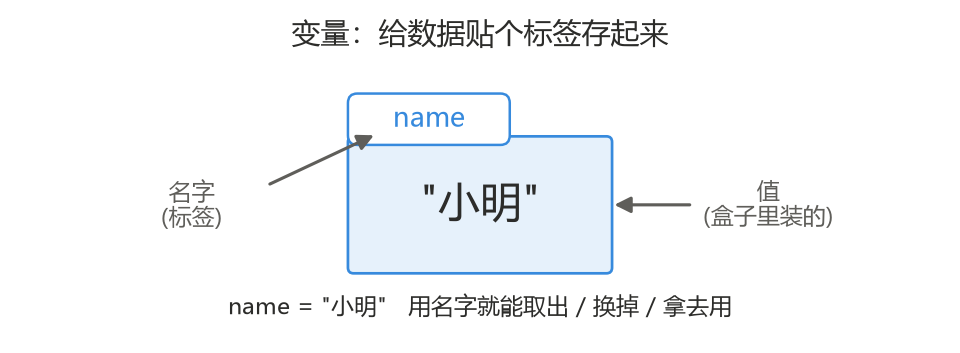
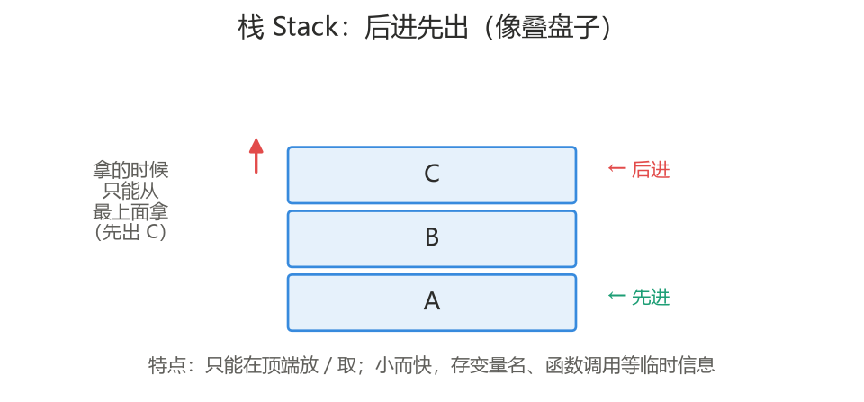
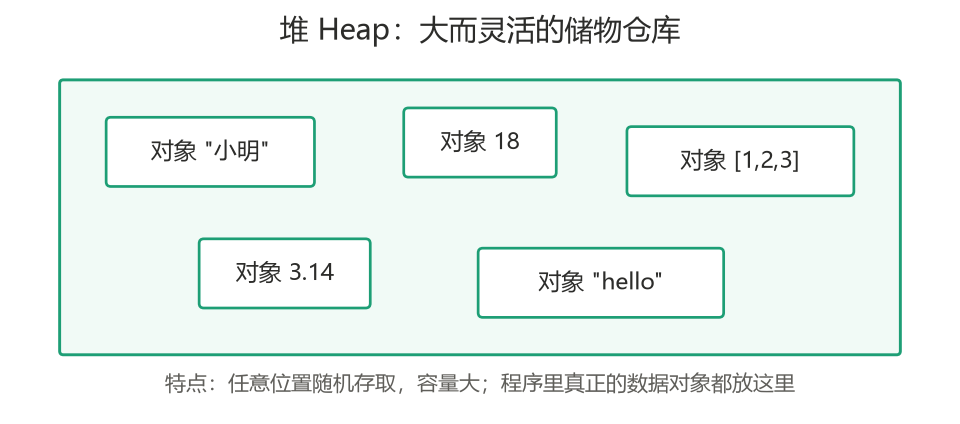
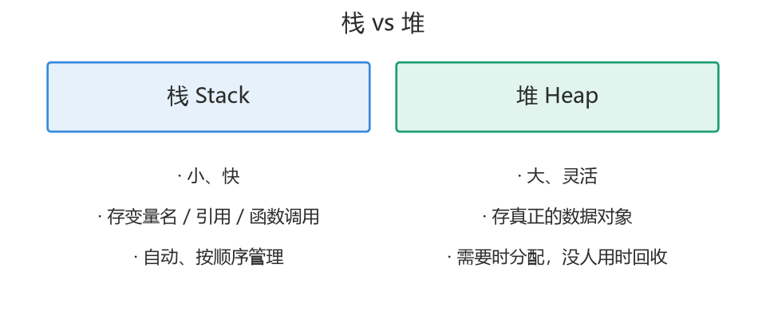
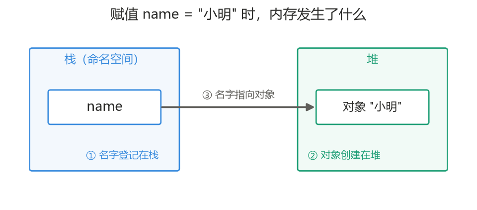
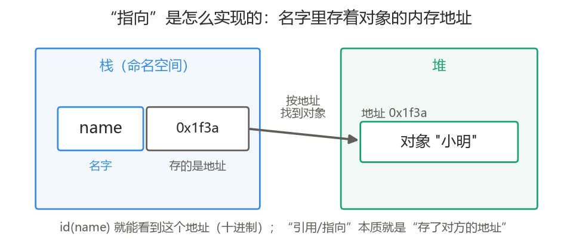
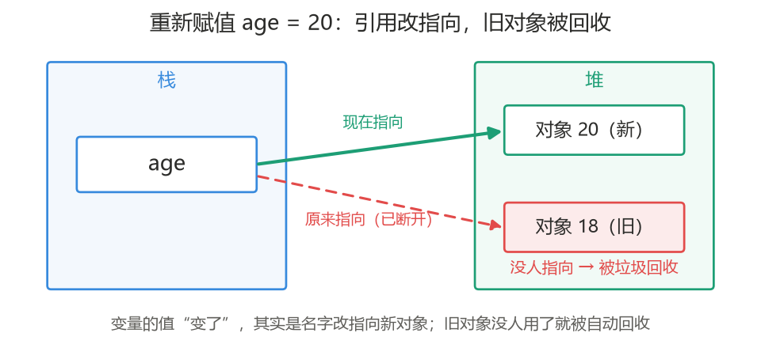
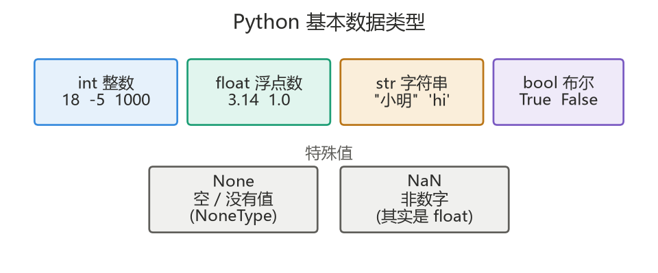
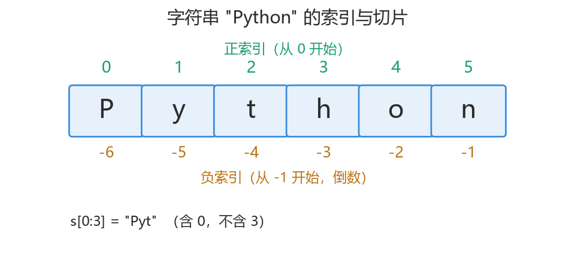

<a id="top"></a>

# Section 2　变量 + 基本数据类型 + 运算

> 本节学习如何用「变量」存储数据、Python 有哪些基本数据类型、如何做类型转换与各种运算，并掌握字符串处理与输入输出，最后用一个 BMI 计算器把它们串起来。
> 承接上一节：上一节只会用 `print` 输出固定文字，本节起程序开始能「记住数据、处理数据」。

---

## 本节导航

| 序号 | 主题                     |
| :--: | :----------------------- |
| 2.1  | [变量是什么](#s21)       |
| 2.2  | [标识符与命名规范](#s22) |
| 2.3  | [基本数据类型](#s23)     |
| 2.4  | [类型转换](#s24)         |
| 2.5  | [运算符](#s25)           |
| 2.6  | [字符串详解](#s26)       |
| 2.7  | [输入与输出](#s27)       |
| 2.8  | [实战：BMI 计算器](#s28) |
|  —   | [本节小结](#summary)     |

---

<a id="s21"></a>

## 2.1　变量是什么

### 2.1.1　先想清楚：为什么要「存」数据

上一节的程序只会输出写死的文字。我们先不急着背定义，先看**不存数据会遇到什么麻烦**，你就明白变量到底解决了什么问题。

**痛点一：同一个数据要用很多次，难道每次都重写一遍？**

假设要输出某个用户的名字三次。如果不存起来，就得把 `"小明"` 写三遍：

```python
print("欢迎你，小明")
print("小明，你有 3 条新消息")
print("再见，小明")
```

问题来了：如果这个名字要改成"小红"，你得**找出每一处、逐个修改**，漏一个就出错。而如果先「存」到一个名字里，改一处就够了：

```python
name = "小明"          # 只在这里存一次
print(f"欢迎你，{name}")
print(f"{name}，你有 3 条新消息")
print(f"再见，{name}")
# 以后要换人，只改上面那一行
```

**痛点二：很多数据不是我们写死的，而是「运行时才产生」的，根本没法提前写进代码。**

比如用户输入的内容、一道题的计算结果——这些值在你写代码的时候**还不存在**，你不可能把它敲进 `print` 里。只能先把它「存」到一个名字里，之后再用：

```python
age = input("请输入年龄：")   # 用户输入什么，写代码时并不知道
print(f"你输入的是 {age}")    # 存起来，才能在后面用到它
```

**痛点三：程序要「处理」数据，就必须先有个地方放它。**

计算 `身高 × 体重`、把两段文字拼起来——这些处理都需要先把参与运算的值放在某处、给它们起个名字，才能对它们做操作。

### 2.1.2　变量：给数据起个名字存起来

上面三个痛点，答案都是同一个东西——**变量**。

**变量是一个带名字的存储位置，用来存放数据。** 有了它，数据就能被反复取用、被修改、被处理。用等号 `=` 把值「存」进去：

```python
name = "小明"
age = 18
```

- `=` 叫**赋值运算符（不是数学的等于）**，意思是「把右边的值，存到左边的名字里」，**不是**数学上的「相等」。
- 存进去之后，程序里凡是用到这个名字的地方，都会取出它存的值：

```python
name = "小明"
print(name)        # 输出：小明
```

### 2.1.3　存起来之后能做什么

数据一旦存进变量，就能：

- **反复使用**：一处存、多处取（痛点一）。
- **接收未知数据**：把运行时才产生的值（如用户输入）存下来再用（痛点二）。
- **参与运算和处理**：对变量做计算、拼接、比较等（痛点三、以及后面几节的内容）。
- **随时更新**：变量的值可以改变，后面的赋值会覆盖前面的：

```python
age = 18
age = 20
print(age)         # 输出：20（新值覆盖了旧值）
```

理解要点：变量就像一个**贴了标签的盒子**——标签是名字，盒子里装的是值；`=` 就是「往盒子里放东西」，用名字就能随时把东西取出来、换掉、或拿去用。**「存」不是目的，「存了之后能反复用、能处理、能应对变化」才是目的。**



### 2.1.4　拓展（选学）：变量在内存里是怎么存的

> 本小节是**选学拓展**，用一组图讲清「栈、堆、变量到底怎么存」的底层原理。零基础同学可以先跳过，不影响后续学习；等写多了代码再回来看会更有体会。

程序运行时，数据存在内存里。内存里有两块用途不同的区域：**栈（Stack）** 和 **堆（Heap）**。先分别认识它们。

#### 一、栈 Stack：后进先出

栈是一块「小而快」的内存，它存取数据有个硬性规则——**只能在顶端放和取**，最后放进去的最先被取出来，这叫「后进先出」，就像叠盘子：只能往最上面叠、也只能从最上面拿。



栈通常用来存**变量名、函数调用**这类临时、生命周期短的信息。它的管理是自动、按顺序的。

#### 二、堆 Heap：大而灵活

堆是一块「大而灵活」的内存，可以在**任意位置随机存取**，容量大。程序里**真正的数据对象**（那些数字、文字、后面会学的列表等）都放在堆里。



#### 三、栈 vs 堆



一句话记住：**栈存「名字和引用」，堆存「真正的对象」。**

#### 四、Python 的模型：名字 → 对象

不同语言把变量放哪儿并不一样。这里要特别说清 **Python 的模型**，因为它和 C / Java 不同，容易被讲错：

**在 Python 里「一切皆对象」——你写的 `18`、`"小明"` 这些数据，本身都是放在「堆」里的对象。变量名不直接装数据，它只是登记在栈（命名空间）里、指向堆中对象的一个「引用（箭头）」。**

以 `name = "小明"` 为例，这一行赋值时，内存里同时发生三件事：



1. 名字 `name` 登记在栈里；
2. 对象 `"小明"` 创建在堆里；
3. 名字通过引用**指向**那个对象。

这也解释了前面「贴标签的盒子」比方为什么准确——**在 Python 里，名字更像「贴在对象上的标签」，而不是「装着值的盒子本身」**。

#### 五、「指向」到底是什么：内存地址

前面一直说名字「指向」对象，那这个「指向」到底是怎么实现的？

答案是**内存地址**。堆里的每个对象都住在一个具体的内存位置，这个位置有个编号，就是**内存地址**（好比每个房子都有门牌号）。所谓「名字指向对象」，实际是**名字里存着那个对象的地址**；程序用到名字时，就按这个地址去堆里找到对象。



一句话：**「引用 / 指向」本质就是「存了对方的地址」。**

在 Python 里可以用内置函数 `id()` **亲眼看到**一个对象的地址（返回的是十进制整数）：

```python
name = "小明"
print(id(name))     # 例如 2103948571632（每次运行可能不同）
```

这也顺带解释了 2.5 会讲的 `is`：`a is b` 判断的就是**两个名字里存的地址是否相同**，即是不是指向同一个对象。

#### 六、重新赋值时发生了什么

理解了「名字→对象」，就能看懂前面说的「变量值会被覆盖」到底是怎么回事。当执行 `age = 18` 后又执行 `age = 20`：



- 并**不是**把堆里那个「18」改成「20」；
- 而是**在堆里新建一个对象「20」，让名字 `age` 改为指向它**；
- 原来的对象「18」没有任何名字指向了，就成了「垃圾」，Python 会**自动回收**它释放内存（这套机制叫垃圾回收 GC，你不用手动管）。

> 对比一下（不必深究）：在 C / Java 里，像 `int` 这样的基本类型变量，值常常直接存在栈上；而 Python 没有这种「变量直接装值」的情况，数据一律是堆里的对象，变量只是引用。**理解 Python 是「名字 → 对象」这一条，就够用了。**

<sub>[返回目录](#top)</sub>

---

<a id="s22"></a>

## 2.2　标识符与命名规范

给变量（以及后面会学的函数等）起的名字，统称**标识符**。起名要遵守规则，也要遵守惯例。

### 2.2.1　命名规则（必须遵守，否则报错）

- 只能由**字母、数字、下划线**组成，且**不能以数字开头**。
- **区分大小写**：`name` 和 `Name` 是两个不同的变量。
- **不能使用关键字**（见下）。

```python
user_name = "ok"     # 正确
age2 = 18            # 正确（数字不在开头）
# 2age = 18            # 错误：不能以数字开头
```

### 2.2.2　命名惯例（建议遵守，让代码更易读）

- 变量名用**小写字母 + 下划线**，即 snake_case 风格：`user_name`、`total_price`。
- 名字要**见名知意**：用 `age` 而不是 `a`，用 `student_count` 而不是 `n`。

### 2.2.3　关键字

关键字是 Python 保留的、有特殊含义的词，不能用作变量名。常见的有：

```
if  elif  else  for  while  break  continue
def  return  class  import  from  as
True  False  None  and  or  not  in  is
try  except  finally  with  lambda
```

无需死记，写代码时用到自然会熟悉；万一用了关键字当变量名，运行会直接报错。

<sub>[返回目录](#top)</sub>

---

<a id="s23"></a>

## 2.3　基本数据类型

变量里存的数据有不同「类型」。Python 最基本的四种：

| 类型    | 名称   | 含义                | 示例                  |
| :------ | :----- | :------------------ | :-------------------- |
| `int`   | 整数   | 没有小数点的数      | `18`、`-5`、`1000`    |
| `float` | 浮点数 | 带小数点的数        | `3.14`、`-0.5`、`1.0` |
| `str`   | 字符串 | 用引号包起来的文本  | `"小明"`、`'hello'`   |
| `bool`  | 布尔值 | 只有两个值：真 / 假 | `True`、`False`       |

```python
age = 18            # int
height = 1.75       # float
name = "小明"       # str
is_student = True   # bool
```

用内置函数 `type()` 可以查看一个值的类型：

```python
print(type(18))         # <class 'int'>
print(type(3.14))       # <class 'float'>
print(type("hi"))       # <class 'str'>
print(type(True))       # <class 'bool'>
```

说明：

- **字符串必须用引号**（单引号 `'` 或双引号 `"` 都行），否则会被当成变量名。
- **布尔值 `True` / `False` 首字母大写**，是 Python 的固定写法。

### 2.3.1　特殊值 None

除了上面四种类型，还有一个常用的特殊值 **`None`**，需要单独认识一下。

**`None` 表示「空 / 什么都没有」**，用来代表「这里暂时没有值」。它自成一类（类型是 `NoneType`），既不是数字 `0`，也不是空字符串 `""`，而是专门表示「无」的一个值。首字母大写，是固定写法。

```python
answer = None            # 表示"还没有答案"
print(answer)            # None
print(type(answer))      # <class 'NoneType'>
```

它的典型用途是给变量一个「还没有内容」的初始值，之后再填入真正的数据。判断一个变量是不是 `None`，惯例用 `is None`（这个写法会在 2.5 运算符里再讲）：

```python
answer = None
print(answer is None)    # True
```

> 如果你听过其他语言里的 `null`：Python 里**没有** `null` 这个词，表示「空」统一用 `None`，作用是一样的。

<sub>[返回目录](#top)</sub>

---

<a id="s232"></a>

### 2.3.2　特殊值 NaN（了解）

`NaN` 是 **Not a Number（非数字）** 的缩写，它是**浮点数（float）里的一个特殊值**，用来表示「一个本该是数字、但无法表示成有效数字的结果」。

它和 `None` 不是一回事：

- `None` 表示「没有值 / 空」。
- `NaN` 表示「是个（浮点）数，但这个数无效 / 算不出来」，它的类型仍然是 `float`。

在标准 Python 里可以这样得到它：

```python
x = float("nan")
print(x)             # nan
print(type(x))       # <class 'float'>
```

**最需要记住的一个「坑」：`NaN` 不等于任何值，连它自己都不等于自己。**

```python
x = float("NaN")
print(x == x)        # False（反直觉，但就是这样）
```

所以**判断一个值是不是 NaN，不能用 `==`**。标准库的做法是用 `math.isnan()`：

```python
import math
x = float("nan")
print(math.isnan(x))     # True
```

什么时候会遇到它？主要在**数据分析**场景——比如读一个表格，某个格子是空的，读进来往往就是 `NaN`（表示「这里缺数据」）。对现在来说，你只需**认识它、记住"NaN 不能用 == 判断"这个坑**即可；更完整的处理（怎么找出、怎么填补缺失值）会在后面数据处理的章节讲。

下面这张图汇总了本节讲的所有类型（四种基本类型 + 两个特殊值）：



<sub>[返回目录](#top)</sub>

---

<a id="s24"></a>

## 2.4　类型转换

不同类型之间可以互相转换，用同名的内置函数：

| 函数       | 作用       | 示例            | 结果   |
| :--------- | :--------- | :-------------- | :----- |
| `int(x)`   | 转成整数   | `int("18")`     | `18`   |
| `float(x)` | 转成浮点数 | `float("3.14")` | `3.14` |
| `str(x)`   | 转成字符串 | `str(18)`       | `"18"` |

常见用途——把用户输入的文字转成数字来计算（下一节的输入会用到）：

```python
age_text = "18"          # 这是字符串
age = int(age_text)      # 转成整数才能做数学运算
print(age + 1)           # 输出：19
```

### 转换失败的坑

转换要「转得过去」才行，否则会报错：

```python
int("abc")       # 报错：无法把 abc 转成整数
int("3.14")      # 报错：带小数点的字符串不能直接转 int
```

- `int("abc")`：`abc` 不是数字，转换失败（`ValueError`）。
- `int("3.14")`：字符串里有小数点，`int()` 不认；要先 `float("3.14")` 再 `int(...)`。

理解要点：转换只在「内容本身合法」时成功。处理用户输入时要特别小心，输入不一定是合法数字。

<sub>[返回目录](#top)</sub>

---

<a id="s25"></a>

## 2.5　运算符

### 2.5.1　算术运算符

| 运算符 | 含义                 | 示例     | 结果  |
| :----: | :------------------- | :------- | :---- |
|  `+`   | 加                   | `3 + 2`  | `5`   |
|  `-`   | 减                   | `3 - 2`  | `1`   |
|  `*`   | 乘                   | `3 * 2`  | `6`   |
|  `/`   | 除（结果是浮点数）   | `7 / 2`  | `3.5` |
|  `//`  | 整除（只取整数部分） | `7 // 2` | `3`   |
|  `%`   | 取余（求余数）       | `7 % 2`  | `1`   |
|  `**`  | 幂（次方）           | `2 ** 3` | `8`   |

### 2.5.2　比较运算符（结果是布尔值）

用于判断两个值是否满足某种关系，结果是**布尔值**：

|  运算符   | 含义                | 示例     | 结果    |
| :-------: | :------------------ | :------- | :------ |
|   `==`    | 等于                | `3 == 2` | `False` |
|   `!=`    | 不等于              | `3 != 2` | `True`  |
|  `>` `<`  | 大于 / 小于         | `3 > 2`  | `True`  |
| `>=` `<=` | 大于等于 / 小于等于 | `2 >= 2` | `True`  |

注意：判断相等是**两个等号 `==`**；一个等号 `=` 是赋值，别混。

### 2.5.3　逻辑运算符

用于连接多个条件，结果是**布尔值**：

| 运算符 | 含义 | 说明                       |
| :----- | :--- | :------------------------- |
| `and`  | 与   | 两边都为真，结果才为真     |
| `or`   | 或   | 只要有一边为真，结果就为真 |
| `not`  | 非   | 取反                       |

```python
print(3 > 2 and 5 > 1)   # True（两个都成立）
print(3 > 2 or 1 > 5)    # True（只要一个成立）
print(not 3 > 2)         # False（对 True 取反）
```

### 2.5.4　赋值运算符

`=` 是基本赋值。还有一批「复合赋值」是常用简写：

```python
count = 10
count += 5     # 等价于 count = count + 5，结果 15
count -= 3     # 等价于 count = count - 3
count *= 2     # 等价于 count = count * 2
```

### 2.5.5　成员与身份运算符

- **成员运算符 `in`**：判断某个东西是否「在」某个序列（如字符串、列表(后面讲)）里。

```python
print("a" in "abc")      # True："a" 在 "abc" 中
print("x" in "abc")      # False
```

- **身份运算符 `is`**：判断两个变量是不是「同一个对象」。入门阶段最常见的用法是判断变量是否为 `None`（`None` 是表示「空」的特殊值，见 2.3.1）：

```python
answer = None
print(answer is None)    # True
```

  判断一个变量是不是 `None`，惯例上用 `is None`（而不是 `== None`）。

区别提示：`==` 比较「值是否相等」，`is` 比较「是否为同一个对象」。日常判断相等用 `==`，判断 `None` 用 `is None`。

<sub>[返回目录](#top)</sub>

---

<a id="s26"></a>

## 2.6　字符串详解

字符串是最常用的数据类型之一，本节重点讲它的常见操作。

### 2.6.1　拼接

用 `+` 把字符串接起来：

```python
first = "小"
last = "明"
print(first + last)      # 小明
```

注意：字符串只能和字符串拼接。要拼数字，得先用 `str()` 转换：

```python
age = 18
print("年龄：" + str(age))    # 年龄：18
```

### 2.6.2　索引与切片

字符串里每个字符都有编号（**索引从 0 开始**）：



```python
s = "Python"
#    012345
print(s[0])      # P（第一个字符）
print(s[-1])     # n（-1 表示最后一个）
```

**切片**：取出其中一段，写法 `s[开始:结束]`（含开始、不含结束）：

```python
s = "Python"
print(s[0:3])    # Pyt（第 0、1、2 个）
print(s[2:])     # thon（从第 2 个到末尾）
print(s[:2])     # Py（开头到第 1 个）
```

### 2.6.3　常用方法

方法是「附在字符串上的功能」，用 `字符串.方法()` 调用：

| 方法             | 作用                 | 示例                      | 结果            |
| :--------------- | :------------------- | :------------------------ | :-------------- |
| `.upper()`       | 转大写               | `"abc".upper()`           | `"ABC"`         |
| `.lower()`       | 转小写               | `"ABC".lower()`           | `"abc"`         |
| `.strip()`       | 去掉首尾空格         | `" hi ".strip()`          | `"hi"`          |
| `.replace(a, b)` | 替换                 | `"a-b".replace("-", "_")` | `"a_b"`         |
| `.split(sep)`    | 按分隔符拆成列表     | `"a,b,c".split(",")`      | `["a","b","c"]` |
| `len(s)`         | 长度（这是内置函数） | `len("abc")`              | `3`             |

### 2.6.4　f-string（格式化字符串）

在字符串前加 `f`，就能用 `{}` 直接把变量嵌进去，这是拼接文本和变量**最推荐**的方式：

```python
name = "小明"
age = 18
print(f"我叫{name}，今年{age}岁")     # 我叫小明，今年18岁
```

`{}` 里还能直接写表达式：

```python
price = 5
count = 3
print(f"总价是 {price * count} 元")   # 总价是 15 元
```

对比一下：f-string 比用 `+` 和 `str()` 拼接清爽得多。

### 2.6.5　转义字符

有些字符不能直接写在字符串里，需要用反斜杠 `\` 转义：

| 转义 | 含义                       |
| :--- | :------------------------- |
| `\n` | 换行                       |
| `\t` | 制表符（Tab）              |
| `\"` | 双引号（在双引号字符串里） |
| `\\` | 反斜杠本身                 |

```python
print("第一行\n第二行")     # 分两行输出
print("姓名\t年龄")         # 姓名和年龄之间空一个 Tab
```

<sub>[返回目录](#top)</sub>

---

<a id="s27"></a>

## 2.7　输入与输出

### 2.7.1　input()：接收用户输入

`input()` 让程序暂停，等用户在终端输入一行文字并回车：

```python
name = input("请输入你的名字：")
print(f"你好，{name}")
```

**关键点：`input()` 拿到的永远是字符串。** 要用作数字，必须转换：

```python
age = input("请输入年龄：")      # age 是字符串，比如 "18"
age = int(age)                  # 转成整数才能计算
print(f"明年你 {age + 1} 岁")
```

### 2.7.2　print() 的格式化输出

`print()` 除了输出，还有几个常用参数：

```python
# 用 sep 指定多个值之间的分隔符（默认是空格）
print("2026", "08", "13", sep="-")     # 2026-08-13

# 用 end 指定结尾（默认是换行 \n）
print("不换行", end="")
print("接着这一行")
```

配合 f-string，输出会既灵活又清晰：

```python
name = "小明"
score = 95
print(f"{name} 的成绩是 {score} 分")
```

<sub>[返回目录](#top)</sub>

---

<a id="s28"></a>

## 2.8　实战：BMI 计算器

综合运用本节内容：输入、类型转换、运算、f-string 输出。

BMI（身体质量指数）公式：**BMI = 体重(kg) ÷ 身高(m) 的平方**。

```python
# 1. 输入身高体重（input 拿到的是字符串，要转成 float）
height = float(input("请输入身高（米），例如 1.75："))
weight = float(input("请输入体重（公斤），例如 65："))

# 2. 计算 BMI，round(x, 1) 保留一位小数
bmi = weight / (height ** 2)
bmi = round(bmi, 1)

# 3. 用 f-string 输出结果
print(f"你的 BMI 是 {bmi}")
```

运行示例（输入 1.75 和 65）：

```
请输入身高（米），例如 1.75：1.75
请输入体重（公斤），例如 65：65
你的 BMI 是 21.2
```

用到的知识点回顾：`input()` 接收输入、`float()` 类型转换、`**` 幂运算、`/` 除法、`round()` 取近似、f-string 输出。

> 本节配套代码见 [`code/part1_python/section2/`](../../code/part1_python/section2/)：
> [01_variables.py](../../code/part1_python/section2/01_variables.py)（变量）·
> [02_data_types.py](../../code/part1_python/section2/02_data_types.py)（基本类型）·
> [03_type_convert.py](../../code/part1_python/section2/03_type_convert.py)（类型转换）·
> [04_operators.py](../../code/part1_python/section2/04_operators.py)（运算符）·
> [05_strings.py](../../code/part1_python/section2/05_strings.py)（字符串）·
> [06_bmi_calculator.py](../../code/part1_python/section2/06_bmi_calculator.py)（BMI 实战）·
> [07_id_address.py](../../code/part1_python/section2/07_id_address.py)（选学：用 id() 看内存地址）
>
> 也可以打开整节的交互式笔记本 [section2.ipynb](../../code/part1_python/section2/section2.ipynb)，边看讲解边逐格运行。

<sub>[返回目录](#top)</sub>

---

<a id="summary"></a>

## 本节小结

**变量与类型**

- 变量是带名字的存储位置，用 `=` 赋值；命名用 snake_case、见名知意、不能用关键字。
- 四种基本类型：`int`、`float`、`str`、`bool`；用 `type()` 查看类型。
- 类型转换用 `int()` / `float()` / `str()`，内容不合法会报错。

**运算与字符串**

- 运算符：算术（`+ - * / // % **`）、比较（`==` 等，结果是布尔）、逻辑（`and/or/not`）、复合赋值（`+=` 等）、成员与身份（`in` / `is`）。
- 字符串：`+` 拼接、索引与切片（从 0 开始）、常用方法、**f-string 是最推荐的格式化方式**、转义字符 `\n` `\t`。

**输入输出**

- `input()` 拿到的永远是字符串，做数字运算前要转换。
- `print()` 可用 `sep` / `end` 控制分隔与结尾。

下一节：控制流（条件判断与循环）。

<sub>[返回目录](#top)</sub>
