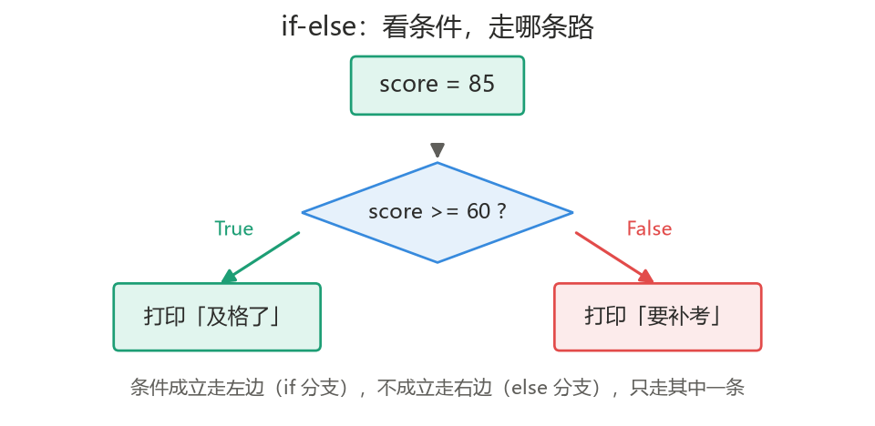
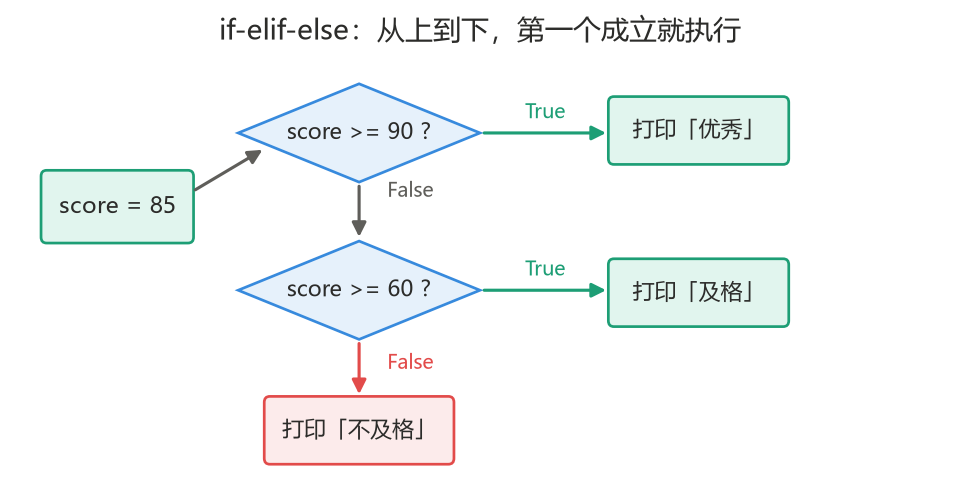
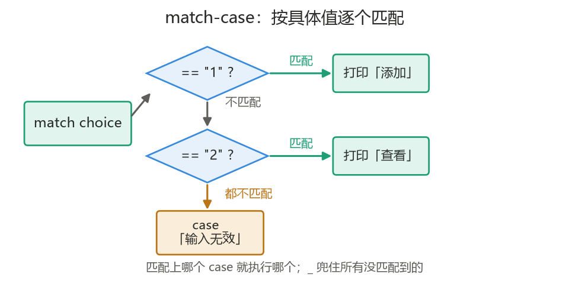
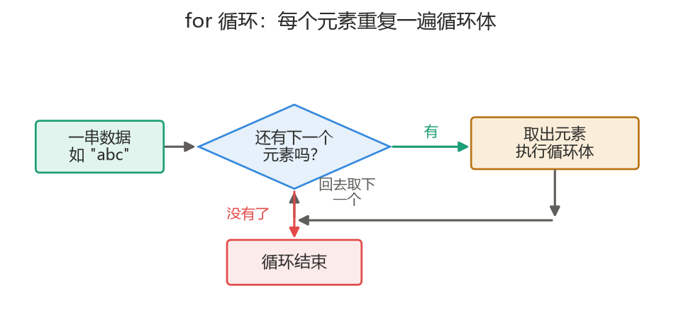
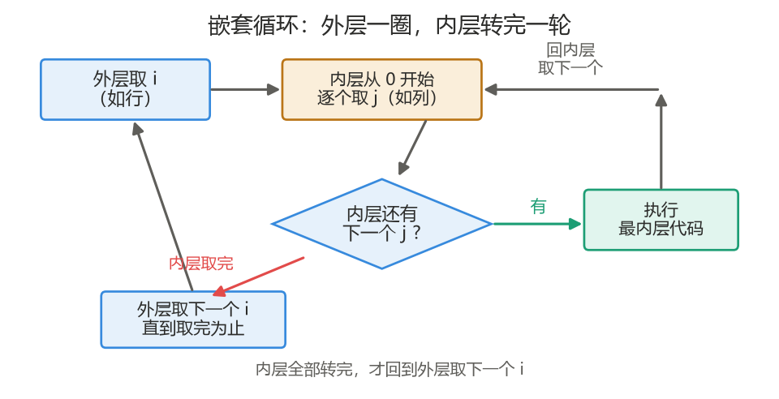
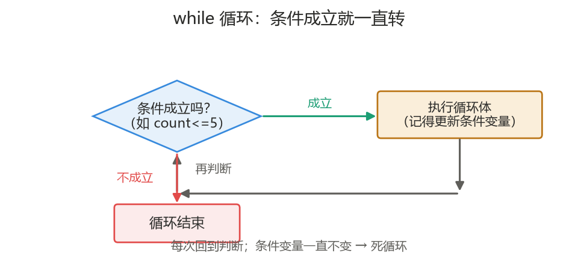
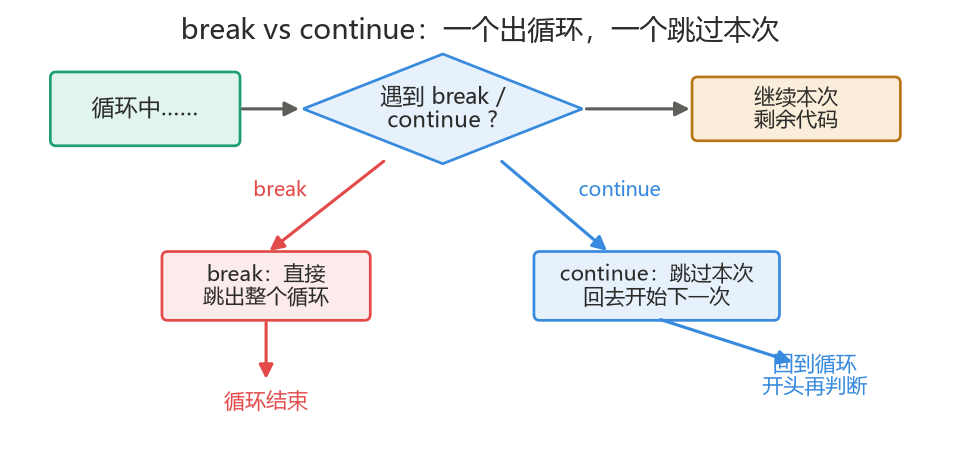

<a id="top"></a>

# Section 3　控制流

> 程序的本质是重复和判断。

---

## 本节导航

| 序号 | 主题                                         |
| :--: | :------------------------------------------- |
| 3.1  | [条件判断 if / match-case](#s31)             |
| 3.2  | [for 循环：让代码重复执行](#s32)             |
| 3.3  | [while 循环](#s33)                           |
| 3.4  | [break 与 continue](#s34)                    |
| 3.5  | [实战：猜数字 / 九九乘法表 / 打印图形](#s35) |
|  —   | [本节小结](#summary)                         |

---

<a id="s31"></a>

## 3.1　条件判断 if / match-case

### 3.1.1　为什么要判断

到现在，我们的程序对任何输入都走同一条路。但真实的很多逻辑是「看情况」来定的。**`if` 让程序根据条件决定执行哪段代码。**

```python
score = 85
if score >= 60:
    print("及格了")
```

读法：`if 条件:` —— 条件成立（为 `True`）就执行缩进的代码，不成立就跳过。**条件就是第 2 节学的、结果为布尔值的表达式**（比较、逻辑运算）。

### 3.1.2　if-else：二选一

条件不成立时想执行另一段，用 `else`：

```python
score = 45
if score >= 60:
    print("及格了")
else:
    print("不及格，要补考")
```



### 3.1.3　if-elif-else：多分支

有多种情况要分别处理，用 `elif`（else if 的缩写），可以写多个：

```python
score = 85
if score >= 90:
    print("优秀")
elif score >= 60:
    print("及格")
else:
    print("不及格")
```

要点：**从上到下依次判断，第一个成立的分支执行后，后面的就不再看了**。所以条件要按"从严到宽"的顺序写。



另外，**`if` 里面还可以再套 `if`（嵌套）**——外层条件成立后，再判断内层：

```python
age = 20
has_ticket = True
if age >= 18:
    if has_ticket:
        print("可以入场")
    else:
        print("请先买票")
else:
    print("未满 18 岁，不能入场")
```

嵌套靠缩进层级区分。提醒：嵌套别超过两三层，太深了说明你对逻辑理解不够透彻（或者换写法），否则读起来费劲。

### 3.1.4　match-case：另一种多分支写法（Python 3.10+）

Python 3.10 （21 年 10 月发布，新特性）引入了 `match-case`，也是做多分支判断。它适合"**根据一个变量的具体取值，分别处理**"的场景：

```python
choice = "1"

match choice:
    case "1":
        print("添加")
    case "2":
        print("查看")
    case "3":
        print("删除")
    case _:                  # 下划线表示"以上都不匹配"的兜底分支
        print("输入无效")
```

执行逻辑：`match` 后面是要判断的变量，程序从上到下把它的值和每个 `case` 比对，匹配上哪个就执行哪个分支，然后结束。`case _` 相当于 `else`，兜住所有没匹配到的情况。



和 `if-elif-else` 的对比：

| 写法                   | 适合的场景                                                           |
| :--------------------- | :------------------------------------------------------------------- |
| `if` / `elif` / `else` | 范围判断（如 `score >= 60`）、各种复杂条件，**万能**                 |
| `match-case`           | 按"具体值"一一对应（如菜单选项 `"1"`/`"2"`/`"3"`），分支很多时更整齐 |

入门阶段以 `if` 系列为主；`match-case` 掌握基本写法、见到能看懂即可。

<sub>[返回目录](#top)</sub>

---

<a id="s32"></a>

## 3.2　for 循环：让代码重复执行

### 3.2.1　循环的本质是「重复」

很多工作本质是重复：给全班 50 个人各打印一张成绩单、把一段检查逻辑跑 100 次……手写 100 遍是不可能的，**循环就是让一段代码自动重复执行**——这才是它的本质。

`for` 循环的读法：`for 临时名字 in 一串东西:` —— **对这串东西里的每一个，重复执行一遍下面缩进的代码**。

```python
for ch in "abc":
    print(ch)      # 对 a、b、c 各重复执行一次 print
```

"对一串东西逐个处理"（也就是遍历）确实是 `for` 最常用的场景，但它只是"重复"的一种——关键是记住：**你要重复的，是缩进里那段逻辑。**



### 3.2.2　补充：range() 生成一串数字

有时我们只想"重复 N 次"，手头并没有一串现成的东西。这时常用 `range()` 生成一串数字供 `for` 逐个取：

```python
for i in range(5):
    print(i)       # 依次输出 0、1、2、3、4
```

`range` 的三种写法：

| 写法              | 含义                           | 产生的数字    |
| :---------------- | :----------------------------- | :------------ |
| `range(5)`        | 从 0 到 5（不含 5）            | 0, 1, 2, 3, 4 |
| `range(1, 6)`     | 从 1 到 6（不含 6）            | 1, 2, 3, 4, 5 |
| `range(0, 10, 2)` | 从 0 到 10，步长 2 （不含 10） | 0, 2, 4, 6, 8 |

和字符串切片一样，**含头不含尾**。

> 说明：`range` 只是"想循环固定次数"时的一个补充工具，实际开发中 `for` 更多是直接遍历数据（第 4 节讲列表后会很明显）。本节后面的练习（九九乘法表、打印图形）会用到它，认识即可。

### 3.2.3　循环里可以累加

循环常配合变量"边循环边累计"：

```python
total = 0
for i in range(1, 101):    # 1 到 100
    total += i
print(total)               # 5050
```

### 3.2.4　循环可以嵌套

**循环里面还可以再放一个循环（嵌套循环）**，`for` 套 `for`、`for` 套 `while` 都行。执行规律：**外层每转一圈，内层要完整转完一轮**——像钟表：分针（内层）转完一圈，时针（外层）才走一格。

```python
for i in range(3):          # 外层：3 圈
    for j in range(2):      # 内层：每圈转 2 次
        print(f"i={i}, j={j}")
# 共输出 3 × 2 = 6 行：i=0,j=0 / i=0,j=1 / i=1,j=0 / ...
```

嵌套循环的典型用途是处理"行列"结构——打印图形、遍历表格。本节实战的九九乘法表（3.5.2）就是外层管行、内层管列。



<sub>[返回目录](#top)</sub>

---

<a id="s33"></a>

## 3.3　while 循环

`for` 适合"知道要循环多少次 / 遍历一串东西"；`while` 适合"**不知道要循环几次，只知道什么时候该停**"——只要条件成立就一直执行：

```python
count = 1
while count <= 5:
    print(f"第 {count} 次")
    count += 1             # 别忘了更新条件变量，否则永远停不下来
```

执行过程：每次先检查条件 `count <= 5`，成立就执行缩进代码，然后再回来检查，直到条件不成立。



**死循环警告**：如果条件永远成立，程序会一直转下去出不来。`while` 循环里一定要有让条件最终不成立的语句（如上例的 `count += 1`）。

两种循环怎么选：

| 场景                           | 用                         |
| :----------------------------- | :------------------------- |
| 知道循环次数、遍历一串数据     | `for`（配 `range` 或容器） |
| 不知道次数、按条件决定是否继续 | `while`                    |

<sub>[返回目录](#top)</sub>

---

<a id="s34"></a>

## 3.4　break 与 continue

循环执行到一半想"提前出去"或"跳过这次"，用这两个关键字：

- **`break`**：立刻结束整个循环（不管条件还成不成立）。
- **`continue`**：跳过本次循环的剩余部分，直接进入下一次。

```python
# break：找到就停
for i in range(1, 10):
    if i == 5:
        break            # 到 5 就结束整个循环
    print(i)             # 输出 1 2 3 4

# continue：跳过偶数
for i in range(1, 10):
    if i % 2 == 0:
        continue         # 偶数跳过，不打印
    print(i)             # 输出 1 3 5 7 9
```

常见组合 `while True` + `break`："一直循环，直到某个条件满足时主动退出"（后面的实战会用到）。

**一个常见误区：`break` / `continue` 是循环专用的，不能单独用在 `if` 里。** 注意上面示例的写法是"**循环里套 `if`**"——`if` 只负责判断"什么时候中断"，真正干活的中断动作只对循环有效。如果离开循环直接用，会直接报错：

```python
x = 5
if x == 5:
    break        # 报错：SyntaxError: 'break' outside loop
```

换句话说：`if` 没有"中断"这回事，`break`/`continue` 离开 `for`/`while` 就没有意义。



<sub>[返回目录](#top)</sub>

---

<a id="s35"></a>

## 3.5　实战：猜数字 / 九九乘法表 / 打印图形

三个经典练习，分别用上 `while`+`if`、嵌套 `for`、循环打印。

### 3.5.1　猜数字

程序想好一个数字，让用户一直猜，每次提示大了还是小了，猜对为止：

```python
import random                # 引入随机数功能（第 5 节会细讲模块）

secret = random.randint(1, 100)    # 随机生成 1 到 100 的整数

while True:
    guess = int(input("猜一个 1-100 的数字："))
    if guess > secret:
        print("大了，再猜")
    elif guess < secret:
        print("小了，再猜")
    else:
        print("恭喜你，猜对了！")
        break
```

知识点：`while True` 一直循环 + 猜对 `break` 退出、`if`/`elif`/`else` 三分支、`input()` 转 `int`。

### 3.5.2　九九乘法表

用 3.2.4 学的嵌套循环，外层管行、内层管列：

```python
for i in range(1, 10):           # 行：1 到 9
    for j in range(1, i + 1):    # 列：1 到 i
        print(f"{j}×{i}={i * j}", end="\t")
    print()                      # 每行结束换行
```

运行效果（节选）：

```
1×1=1
1×2=2	2×2=4
1×3=3	2×3=6	3×3=9
...
```

知识点：`range(1, i + 1)` 让每行多一格、`end="\t"` 让输出不换行而是用 Tab 隔开（第 2 节学的 `print` 参数）。

### 3.5.3　打印图形

用循环打印一个三角形：

```python
for i in range(1, 6):
    print("*" * i)
```

输出：

```
*
**
***
****
*****
```

知识点：字符串可以乘整数（`"*" * 3` 得到 `"***"`），配合 `range` 控制每行个数。想打印倒三角、金字塔，改一改 `range` 和乘的数量即可。

> 本节配套代码见 [`code/part1_python/section3/`](../../code/part1_python/section3/)，也可以打开整节的交互式笔记本 [section3.ipynb](../../code/part1_python/section3/section3.ipynb)，边看讲解边逐格运行：
> [01_if.py](../../code/part1_python/section3/01_if.py)（条件判断与 match-case）·
> [02_for_range.py](../../code/part1_python/section3/02_for_range.py)（for 循环）·
> [03_while.py](../../code/part1_python/section3/03_while.py)（while 循环）·
> [04_break_continue.py](../../code/part1_python/section3/04_break_continue.py)（break 与 continue）·
> [05_guess_number.py](../../code/part1_python/section3/05_guess_number.py)（实战：猜数字）·
> [06_multiplication_table.py](../../code/part1_python/section3/06_multiplication_table.py)（实战：九九乘法表与打印图形）

<sub>[返回目录](#top)</sub>

---

<a id="summary"></a>

## 本节小结

**条件判断**

- `if 条件:` 条件成立才执行；`else` 二选一；`elif` 多分支、从上到下第一个成立就执行。
- `if` 可以嵌套（外层成立再判内层），但别超过两三层。
- `match-case`（3.10+）：按具体值匹配的多分支写法，`case _` 兜底；入门以 if 系列为主。

**循环**

- 循环的本质是**重复执行一段逻辑**；`for` 对这串东西里的每一个重复一遍。
- `range()`：想循环固定次数时的补充工具（含头不含尾）。
- `while`：按条件决定是否继续，适合不知道次数的场景；注意别写成死循环。
- `break` 结束整个循环，`continue` 跳过本次；`while True` + `break` 是常见组合。它们只对循环有效，离开循环单独用会报 `SyntaxError: 'break' outside loop`。
- 循环可以嵌套：外层每转一圈，内层完整转完一轮（打印图形、九九乘法表都靠它）。

下一节：数据结构（容器类型）。

<sub>[返回目录](#top)</sub>
