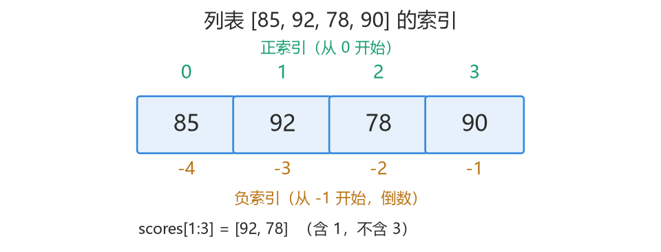
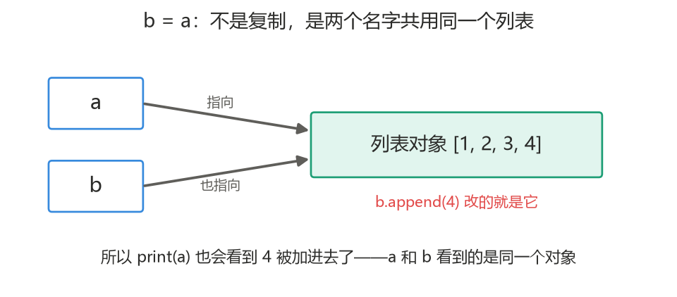
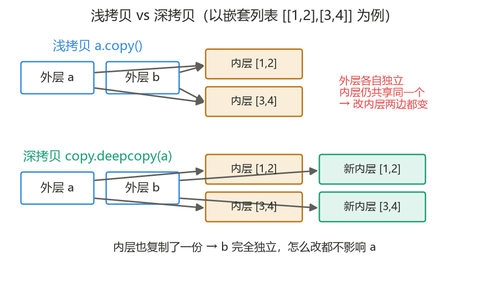

<a id="top"></a>

# Section 4　数据结构（容器类型）

---

## 本节导航

| 序号 | 主题                               |
| :--: | :--------------------------------- |
| 4.1  | [什么是容器类型](#s41)             |
| 4.2  | [列表 List](#s42)                  |
| 4.3  | [字典 Dict](#s43)                  |
| 4.4  | [元组 Tuple 与集合 Set](#s44)      |
| 4.5  | [可变 vs 不可变、引用与拷贝](#s45) |
| 4.6  | [实战：简易通讯录](#s46)           |
|  —   | [本节小结](#summary)               |

---

<a id="s41"></a>

## 4.1　什么是容器类型

到目前为止，一个变量只装一个值：`age = 18`、`name = "小明"`。但现实中的数据往往是**一组**：一个班所有学生的成绩、一个通讯录里所有联系人……

**容器类型就是「一个变量里能装多个值」的类型。** Python 最常用的四种：

| 容器         | 长什么样           | 一句话特点                     |
| :----------- | :----------------- | :----------------------------- |
| 列表 `list`  | `[1, 2, 3]`        | 有序、能装任意多个、**可以改** |
| 字典 `dict`  | `{"name": "小明"}` | 按键（名字）存取值，查找快     |
| 元组 `tuple` | `(1, 2, 3)`        | 和列表类似，但**不能改**       |
| 集合 `set`   | `{1, 2, 3}`        | 无序、**自动去重**             |

其实第 2 节的字符串也是一种"装多个字符的序列"——所以字符串的索引、切片、`in`、`len()` 这些用法，在列表上几乎完全一样，可以直接迁移过来。

<sub>[返回目录](#top)</sub>

---

<a id="s42"></a>

## 4.2　列表 List

列表是最常用的容器：**用方括号 `[]` 表示，元素之间有先后顺序**。

### 4.2.1　创建、索引与切片

```python
scores = [85, 92, 78, 90]
```

索引和切片与字符串完全一致（**索引从 0 开始**）：

```python
scores = [85, 92, 78, 90]
print(scores[0])     # 85（第一个元素）
print(scores[-1])    # 90（最后一个）
print(scores[1:3])   # [92, 78]（含 1 不含 3）
print(len(scores))   # 4（元素个数）
```



### 4.2.2　增、删、改、查

列表是**可变的**：创建之后可以往里加、往外删、改内容。

```python
fruits = ["苹果", "香蕉", "橙子"]

# 增
fruits.append("西瓜")        # 加到末尾
fruits.insert(1, "葡萄")     # 插到索引 1 的位置

# 改
fruits[0] = "梨"             # 直接按索引赋值

# 删
fruits.remove("香蕉")        # 按内容删除（删第一个匹配项）
last = fruits.pop()          # 删最后一个，并把它取出来

# 查
print("葡萄" in fruits)      # True
print(fruits.index("葡萄"))  # 它在第几个（索引）
```

### 4.2.3　遍历

**遍历 = 把列表里的元素一个一个取出来处理。** 第 3 节学的 `for` 在这里派上用场：

```python
scores = [85, 92, 78, 90]
for s in scores:
    print(s)
```

依次取出 scores 里的每个元素，临时叫它 `s`，执行缩进的代码。遍历时如果还需要序号，用 `enumerate()`：

```python
for i, s in enumerate(scores):
    print(f"第 {i + 1} 个：{s}")
```

`enumerate(scores)` 会在遍历时同时给你"序号 i 和元素 s"（序号从 0 开始，所以显示时 +1）。

遍历时还有一个好帮手 **`zip()`：把两串数据配成对，成对取出**：

```python
names = ["小明", "小红", "小刚"]
scores = [85, 92, 78]

for name, s in zip(names, scores):
    print(f"{name}：{s} 分")
# 小明：85 分
# 小红：92 分
# 小刚：78 分
```

注意：`zip` 按位置一一配对，**长度不一致时多余的会被忽略**。

### 4.2.4　列表推导式

想"根据一个列表，加工出另一个列表"，推导式是最简洁的写法：

```python
# 普通写法
doubled = []
for s in [85, 92, 78]:
    doubled.append(s * 2)

# 推导式写法：一行搞定
doubled = [s * 2 for s in [85, 92, 78]]
print(doubled)     # [170, 184, 156]
```

还能带条件筛选：

```python
scores = [85, 92, 78, 90]
high = [s for s in scores if s >= 90]
print(high)        # [92, 90]
```

读法：`[对元素做什么 for 元素 in 列表 if 条件]`。推导式生成的是**新列表**，不改原列表。

### 4.2.5　map 与 filter

`map` 和 `filter` 是两个很常用的加工列表的工具。它们第一个参数要传**一个函数**——别慌，**不需要自己写函数**，用我们已经见过的内置函数就行（比如第 2 节学的 `int`、`str`）。

**`map(函数, 列表)`：对每个元素套用同一个函数**

```python
nums = [1, 2, 3]
print(list(map(str, nums)))     # ['1', '2', '3']：每个元素都过一遍 str()

# 很实用的场景：把一串输入文字全转成数字
texts = ["85", "92", "78"]
scores = list(map(int, texts))
print(scores)                   # [85, 92, 78]
```

读法：`map(str, nums)` 就是"把 `str` 这个函数，挨个作用到 nums 的每个元素上"。注意 `map` 里写的是 `str` 而**不是** `str()`——传的是"函数本身"（一个加工动作），不是调用它的结果。

**`filter(函数, 列表)`：函数判断为真的元素才留下**

```python
items = ["85", "abc", "92", ""]
print(list(filter(None, items)))
# ['85', 'abc', '92']：None 表示"按真假判断"，空字符串被滤掉
```

**一个必须知道的细节：`map`/`filter` 返回的不是列表，而是一个"迭代器"**（可以理解为"一张待加工的清单"，还没真正执行）。所以要用 `list(...)` 包一层才能看到结果：

```python
result = map(str, [1, 2, 3])
print(result)              # <map object at 0x...>：只是个"待加工清单"
print(list(result))        # ['1', '2', '3']：list() 才真正执行并转成列表
```

**和推导式的关系**：两者功能高度重叠——

```python
list(map(str, nums))          # 等价于 [str(x) for x in nums]
```

实际写代码时**优先用列表推导式**，更符合 Python 风格；但 `map`/`filter` 在阅读别人代码、以及像 `map(int, ...)` 这种"直接套用现成函数"的场景里很常见，要会用。配合**自定义函数**（`def` / `lambda`）它们会更灵活——那是第 5 节函数的内容。

<sub>[返回目录](#top)</sub>

---

<a id="s43"></a>

## 4.3　字典 Dict

列表靠 **位置（索引）** 找元素；字典靠 **名字（键）** 找元素。它存的是一对一对的「键值对」，像查字典：按词条（键）查解释（值）。

### 4.3.1　创建与访问

```python
student = {"name": "小明", "age": 18, "city": "深圳"}

print(student["name"])     # 小明（按键取值）
```

注意：

- 键是唯一的；值可以任意。
- 用**不存在的键**取值会直接报错（`KeyError`）——所以有了下面的 `get`。

### 4.3.2　常用操作

```python
student = {"name": "小明", "age": 18}

# 增 / 改：对键赋值即可，键不存在就是新增，存在就是修改
student["city"] = "深圳"     # 新增
student["age"] = 19          # 修改

# 删
del student["city"]

# 查（推荐用 get：键不存在时返回默认值，不报错）
print(student.get("name"))           # 小明
print(student.get("phone"))          # None（没有这个键，不报错）
print(student.get("phone", "未知"))  # 未知（可自定义默认值）

# 判断键是否存在
print("name" in student)     # True
```

**`[]` 取值 vs `get()` 取值**：键一定存在时两者都行；键可能不存在时用 `get()` 更安全。

### 4.3.3　遍历

**遍历字典，默认拿到的是"键"**，再按键取值：

```python
student = {"name": "小明", "age": 18}

for key in student:                  # key 依次是 "name"、"age"
    print(key, student[key])
```

**想同时拿到键和值，用 `.items()`**。它是字典自带的一个方法，作用是"**把每一对键值对都交出来**"——每循环一次，就给你一对（键和值两个东西）。`for` 后面写两个名字，就分别接住这对里的"键"和"值"：

```python
for key, value in student.items():
    print(f"{key}: {value}")
# name: 小明
# age: 18
```

拆开理解：

- `student.items()`：交出所有键值对（可以理解成给你一串 `("name", "小明")`、`("age", 18)` 这样的成对数据）。
- `for key, value in ...`：每次取出一对，**左边名字接键、右边名字接值**。

这是遍历字典**最常用**的写法。和它同族的还有两个方法，见到认识即可：`.keys()` 只交出所有键、`.values()` 只交出所有值。

### 4.3.4　字典推导式

和列表推导式同理，用花括号、给出「键: 值」：

```python
scores = {"小明": 85, "小红": 92, "小刚": 78}
passed = {name: s for name, s in scores.items() if s >= 80}
print(passed)     # {'小明': 85, '小红': 92}
```

<sub>[返回目录](#top)</sub>

---

<a id="s44"></a>

## 4.4　元组 Tuple 与集合 Set

### 4.4.1　元组：不能改的列表

元组用**圆括号 `()`**，用法和列表几乎一样（索引、切片、遍历都行），唯一区别是**创建后不能修改**：

```python
point = (3, 5)
print(point[0])        # 3
# point[0] = 9         # 报错！元组不能改
```

**什么时候用元组**：数据是「一组固定、不该被改动」的值时，比如坐标 `(x, y)`、一条数据库记录。不能改是优点——防止误改，也让别人一看就知道这份数据是固定的。

> 细节：单元素元组必须带逗号 `(3,)`，否则 `(3)` 只是数字 3。

### 4.4.2　集合：自动去重、无序

集合用**花括号 `{}`**，特点：**元素不重复、没有顺序、不能用索引取**：

```python
tags = {"python", "sql", "python"}
print(tags)            # {'python', 'sql'}（重复的自动去掉）
```

**什么时候用集合**：去重、判断"在不在里面"（`in` 对集合很快）、做交并集运算。

```python
# 给列表去重的常用技巧
nums = [1, 2, 2, 3, 3, 3]
unique = list(set(nums))
print(unique)          # [1, 2, 3]
```

> 注意：空集合要写 `set()`，不能写 `{}`（`{}` 是空字典）。

### 4.4.3　四种容器怎么选

| 需求                                   | 用这个 |
| :------------------------------------- | :----- |
| 一组有序、可能重复、要增删改的数据     | 列表   |
| 按名字/编号快速查找的数据（"键 → 值"） | 字典   |
| 一组固定不变的数据                     | 元组   |
| 去重、成员判断、交并集                 | 集合   |

<sub>[返回目录](#top)</sub>

---

<a id="s45"></a>

## 4.5　可变 vs 不可变、引用与拷贝

这是本节最重要、也最容易踩坑的部分。我们先从一个"见鬼了"的现象入手，一步步拆开看，最后用 2.1.4 的内存模型把原理讲透。

### 4.5.1　先看一个"诡异"的现象

下面这段代码，你先心里猜一下 `a` 会输出什么：

```python
a = [1, 2, 3]
b = a            # 直觉上：b 是 a 的"一份复制"
b.append(4)      # 我只往 b 里加东西

print(b)         # [1, 2, 3, 4]（正常）
print(a)         # [1, 2, 3, 4] ← ？？？我明明没动 a！
```

**明明只改了 `b`，`a` 却跟着变了。** 这是几乎每个 Python 初学者都会栽一次的地方。

更"气人"的是，同样的写法换成数字，又是正常的：

```python
a = 100
b = a
b = b + 1        # 改 b

print(b)         # 101
print(a)         # 100（a 没跟着变，很正常）
```

**为什么列表改一个、另一个跟着变；数字却不会？** 搞懂这一个区别，4.5 节就学会了。

### 4.5.2　拆开看：b = a 到底干了什么

回忆 2.1.4 的内存模型：**变量名只是"指向对象的标签"，赋值 `=` 是"贴标签"，不是"复制内容"。**

用这个模型，逐行走一遍上面的列表代码：

| 执行的代码 | 内存里发生的事 |
| :--- | :--- |
| `a = [1, 2, 3]` | 堆里创建列表对象 `[1, 2, 3]`，名字 `a` 指向它 |
| `b = a` | **没有新建列表**！只是让 `b` 也指向同一个列表对象 |
| `b.append(4)` | 通过 `b` 找到那个列表，往里加 4——`a` 指的也是它，自然跟着变 |



**用 `id()` 亲眼验证**（2.1.4 学过，`id()` 能看对象的内存地址）：

```python
a = [1, 2, 3]
b = a
print(id(a) == id(b))    # True：a 和 b 指的是同一个对象！
print(a is b)            # True：用 is 判断也一样
```

而数字为什么没事？因为**数字是"不可变"的**——`b = b + 1` 并没有"修改"原来那个 100，而是**新建**了一个对象 101，让 `b` 改指向它。`a` 还指着原来的 100，纹丝不动。（这正是 2.1.4"重新赋值"那张图讲的。）

所以关键差异只有一句话：**列表可以在原地被修改，数字不能。**

### 4.5.3　可变类型 vs 不可变类型

按"能不能原地修改"，Python 的类型分两类：

| 类别 | 类型 | 能不能原地改 |
| :--- | :--- | :--- |
| **不可变** | `int`、`float`、`str`、`bool`、`tuple` | 不能。所有"修改"操作其实都是生成新对象 |
| **可变** | `list`、`dict`、`set` | 能。`append`、`del` 等都是直接改原对象 |

字符串就是不可变的典型——你从来没有"改过"任何字符串：

```python
s = "hello"
s = s.upper()     # 不是把 "hello" 改成大写，而是生成了新字符串 "HELLO"，让 s 指向它
```

而列表的 `append`、`remove`、按索引赋值，都是**原地改**：

```python
lst = [1, 2, 3]
lst.append(4)     # 原地修改，lst 指向的还是同一个列表对象
```

**记法：只有可变类型（list/dict/set）才有"改一个另一个也变"的坑**；不可变类型随便赋值传递，永远安全。

### 4.5.4　浅拷贝：只复制最外层

如果确实想要一份"独立的副本"，就不能只写 `b = a`，要**拷贝**。最常用的是浅拷贝——复制**最外面一层**：

```python
a = [1, 2, 3]
b = a.copy()     # 浅拷贝（也可写 b = a[:] 或 b = list(a)）

b.append(4)
print(a)                 # [1, 2, 3]（这次 a 不跟着变了）
print(b)                 # [1, 2, 3, 4]
print(id(a) == id(b))    # False：确实是两个不同的列表对象了
```

但浅拷贝有个陷阱——**它只复制最外层。如果列表里还套着列表，内层不会被复制，还是共享的**：

```python
a = [[1, 2], [3, 4]]     # 列表里套列表
b = a.copy()             # 浅拷贝：外层是新的，但里面的两个小列表还是原来那两个
b[0].append(99)          # 改 b 的内层

print(a)                 # [[1, 2, 99], [3, 4]] —— a 的内层还是跟着变了！
```

用内存模型理解：`a.copy()` 新建了外层列表，但新外层里装的"内层列表的标签"，还是从原来那儿照抄的——指向的还是原来那两个内层对象。

### 4.5.5　深拷贝：连内层一起复制

要完全独立、连内层都复制一份，用标准库 `copy` 模块的 `deepcopy`：

```python
import copy

a = [[1, 2], [3, 4]]
b = copy.deepcopy(a)     # 深拷贝：外层、内层、内层的内层……全部复制
b[0].append(99)

print(a)     # [[1, 2], [3, 4]]（a 完全不受影响）
print(b)     # [[1, 2, 99], [3, 4]]
```



### 4.5.6　什么时候要当心

- 把一个列表/字典**赋值给另一个变量**，然后两边都要改 → 记得先 `copy()`。
- 列表/字典里**还套着列表/字典**（嵌套结构）→ 要完全独立就用 `copy.deepcopy()`。
- 以后学函数（第 5 节）把列表传进函数里改，也是同一个坑——函数里外指的是同一个对象。

一句话总结：

- `b = a`：**不复制**，两个名字共用同一个对象。
- `b = a.copy()`：**浅拷贝**，外层独立、内层共享。
- `b = copy.deepcopy(a)`：**深拷贝**，完全独立。

<sub>[返回目录](#top)</sub>

---

<a id="s46"></a>

## 4.6　实战：简易通讯录

综合运用本节内容：用**字典**存一个联系人（键是"姓名/电话"这类字段名），用**列表**装多个联系人。再配上第 3 节的 `while` 循环和 `if` 判断，就能做成一个**带菜单、可以一直操作**的通讯录：

```python
contacts = []

while True:
    print("\n===== 通讯录 =====")
    print("1. 添加联系人")
    print("2. 查看全部")
    print("3. 按姓名查找")
    print("4. 退出")
    choice = input("请选择操作（1-4）：")

    if choice == "1":
        name = input("请输入姓名：")
        phone = input("请输入电话：")
        contacts.append({"name": name, "phone": phone})
        print(f"已添加：{name}")

    elif choice == "2":
        if len(contacts) == 0:
            print("通讯录是空的")
        else:
            for c in contacts:
                print(f"{c['name']}：{c['phone']}")

    elif choice == "3":
        target = input("请输入要查找的姓名：")
        found = False
        for c in contacts:
            if c["name"] == target:
                print(f"找到了：{c['name']} 的电话是 {c['phone']}")
                found = True
        if not found:
            print(f"通讯录里没有 {target}")

    elif choice == "4":
        print("再见！")
        break

    else:
        print("输入无效，请输入 1-4")
```

运行示例：

```
===== 通讯录 =====
1. 添加联系人
2. 查看全部
3. 按姓名查找
4. 退出
请选择操作（1-4）：1
请输入姓名：小明
请输入电话：13800000001
已添加：小明
...
请选择操作（1-4）：2
小明：13800000001
```

用到的知识点回顾：`while True` 循环 + `break` 退出（第 3 节）、`if`/`elif`/`else` 分支（第 3 节）、列表 `append` / 遍历、字典创建与取值、`input()`、f-string、逻辑值标记（`found`）。

> 本节配套代码见 [`code/part1_python/section4/`](../../code/part1_python/section4/)，也可以打开整节的交互式笔记本 [section4.ipynb](../../code/part1_python/section4/section4.ipynb)，边看讲解边逐格运行：
> [01_list_basics.py](../../code/part1_python/section4/01_list_basics.py)（列表增删改查）·
> [02_list_loop.py](../../code/part1_python/section4/02_list_loop.py)（遍历与推导式）·
> [03_dict_basics.py](../../code/part1_python/section4/03_dict_basics.py)（字典）·
> [04_tuple_set.py](../../code/part1_python/section4/04_tuple_set.py)（元组与集合）·
> [05_mutable_copy.py](../../code/part1_python/section4/05_mutable_copy.py)（可变/引用/拷贝）·
> [06_contacts.py](../../code/part1_python/section4/06_contacts.py)（通讯录实战）

<sub>[返回目录](#top)</sub>

---

<a id="summary"></a>

## 本节小结

**四种容器**

- 列表 `list`：有序可变，`append`/`insert`/按索引改、`remove`/`pop` 删、`in`/`index` 查，`for` 遍历（`enumerate` 带序号、`zip` 配对），推导式一行造新列表；`map`/`filter` 传内置函数即可用，返回值要 `list()` 才能看到。
- 字典 `dict`：键值对，按键存取；键可能不存在时用 `get()` 更安全；`items()` 遍历键值。
- 元组 `tuple`：不能改的列表，装固定数据。集合 `set`：无序去重，判断成员、去重快。

**引用与拷贝（重点）**

- 不可变（int/str/tuple 等）"改"是新建对象；可变（list/dict/set）是原地改。
- `b = a` 不复制，两个名字共用同一对象——改一个另一个跟着变。
- 浅拷贝 `a.copy()` 只独立外层；嵌套结构要完全独立用 `copy.deepcopy(a)`。

下一节：函数进阶与模块。

<sub>[返回目录](#top)</sub>
