<a id="top"></a>

# Section 5　函数与模块

---

## 本节导航

| 序号 | 主题                                          |
| :--: | :-------------------------------------------- |
| 5.1  | [为什么要用函数、定义与调用](#s51)            |
| 5.2  | [参数：位置 / 默认 / 关键字 / 可变参数](#s52) |
| 5.3  | [返回值、作用域、闭包入门](#s53)              |
| 5.4  | [Lambda 与高阶函数](#s54)                     |
| 5.5  | [常用内置函数与递归入门](#s55)                |
| 5.6  | [模块与 import](#s56)                         |
| 5.7  | [第三方包：pip 与 requests](#s57)             |
| 5.8  | [实战：成绩统计工具箱](#s58)                  |
| 5.9  | [类型提示](#s59)                              |
|  —   | [本节小结](#summary)                          |

---

<a id="s51"></a>

## 5.1　为什么要用函数、定义与调用

### 5.1.1　从一段重复代码说起

假设要给三个班的平均分各打印一句汇报，不用函数时是这样的：

```python
scores1 = [85, 92, 78]
scores2 = [60, 75, 88]
scores3 = [90, 91, 95]

avg1 = sum(scores1) / len(scores1)
print(f"一班的平均分是 {avg1:.1f}")
avg2 = sum(scores2) / len(scores2)
print(f"二班的平均分是 {avg2:.1f}")
avg3 = sum(scores3) / len(scores3)
print(f"三班的平均分是 {avg3:.1f}")
```

同一个"算平均分再打印"的动作抄了三遍。问题不只是累：

- **改一处要改全部**：汇报格式要调整，得改三行，漏一处就是 bug。
- **读的人要逐行核对**：三段到底是不是同一个逻辑？得自己比对。

### 5.1.2　函数：给一个动作起个名字

**函数 = 把一段完成某个动作的代码打包，起个名字，以后喊名字就能用。**

```python
def report(class_name, scores):
    avg = sum(scores) / len(scores)
    print(f"{class_name}的平均分是 {avg:.1f}")

report("一班", [85, 92, 78])
report("二班", [60, 75, 88])
report("三班", [90, 91, 95])
```

拆开看这两部分：

- `def report(class_name, scores):` —— **定义**函数。`def` 后面是函数名，括号里 `class_name`、`scores` 叫**形参**（形式参数），相当于函数内部的"空位"，等调用时被填上。缩进的代码块是函数体，也就是那个动作本身。
- `report("一班", [85, 92, 78])` —— **调用**函数。括号里给的实际值 `"一班"`、`[85, 92, 78]` 叫**实参**（实际参数），它们会被填到形参的空位上：`class_name` 拿到 `"一班"`，`scores` 拿到那个列表。

定义只是"注册"了这个动作，**不会执行**；喊一次名字（调用一次）才执行一次。这正是函数的第一个好处：**写一遍，用无数次**。第二个好处是**起名字本身就是文档**——`report(...)` 一眼看懂在干嘛，不用逐行读。

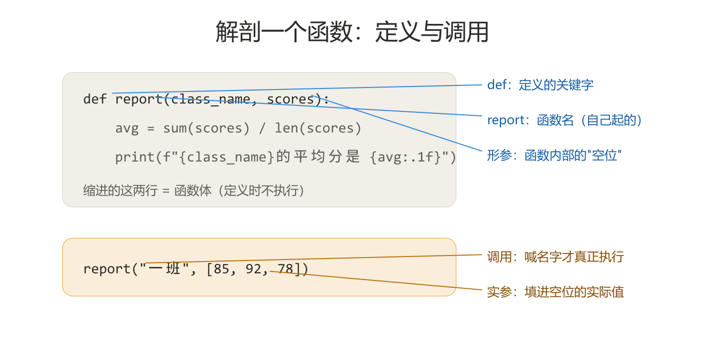

其实你早就用过函数了：`print()`、`len()`、`sum()`、`input()` 都是 Python 自带的函数，`map(str, nums)` 里的 `str` 也是。这一节学的是：**自己造一个**。

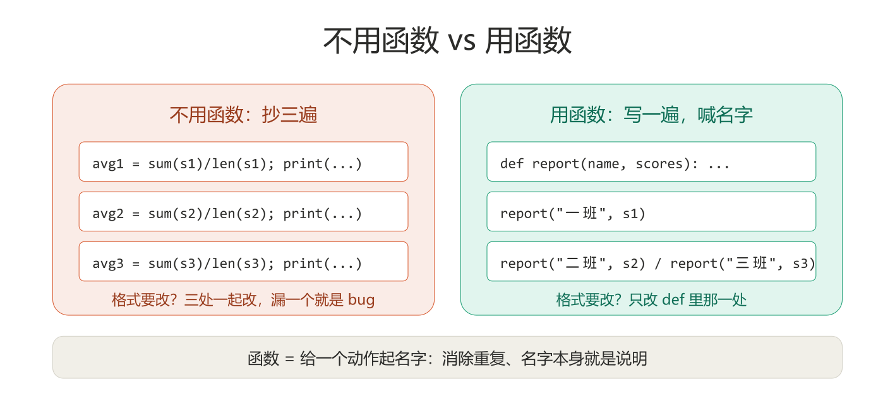

### 5.1.3　调用时发生了什么

调用一个函数时，程序的执行会"跳进去、办完事、再跳回来"：

1. 执行到 `report("一班", [85, 92, 78])`，先把实参填进形参；
2. **跳进**函数体，从头执行到尾；
3. 函数体执行完（或遇到 `return`），**跳回**调用那一行，继续往下走。

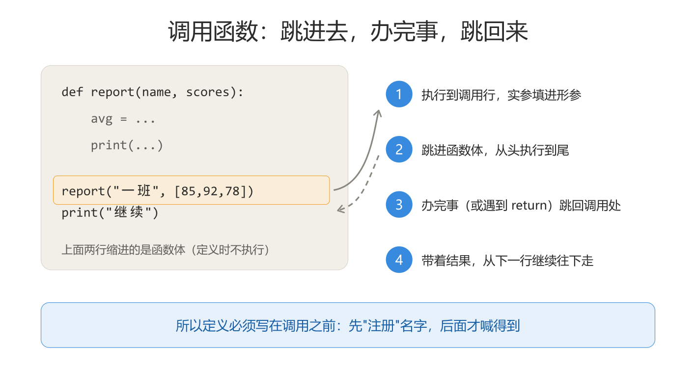

这也解释了一个常见疑问：**定义必须写在调用之前**。程序从上到下执行，得先"注册"过这个名字，后面喊它才认识。

```python
def report(class_name, scores):
    avg = sum(scores) / len(scores)
    print(f"{class_name}的平均分是 {avg:.1f}")

report("一班", [85, 92, 78])     # 正确：先定义，后调用
```

<sub>[返回目录](#top)</sub>

---

<a id="s52"></a>

## 5.2　参数：位置 / 默认 / 关键字 / 可变参数

### 5.2.1　位置参数：按顺序对号入座

最普通的传参方式：**实参按位置依次填进形参**，第一个对第一个，第二个对第二个。

```python
def introduce(name, city):
    print(f"我是{name}，来自{city}")

introduce("小明", "深圳")     # 我是小明，来自深圳
introduce("深圳", "小明")     # 我是深圳，来自小明（顺序错了，Python 不拦你）
```

顺序就是全部含义——写反了 Python 不会报错，只是结果离谱。所以位置参数要**记清顺序**。

### 5.2.2　默认参数：给形参一个"缺省值"

定义时用 `形参=默认值`，调用时**不传这个参数就用默认值**：

```python
def introduce(name, city="深圳"):
    print(f"我是{name}，来自{city}")

introduce("小明")              # 我是小明，来自深圳（city 用默认值）
introduce("小红", "广州")      # 我是小红，来自广州（传了就覆盖默认）
```

适合"大多数情况都一样"的参数。注意：**带默认值的形参必须放在不带默认值的后面**，否则 Python 分不清位置。

### 5.2.3　关键字参数：指名道姓地传

调用时写 `形参名=值`，就**不用管顺序**了：

```python
def introduce(name, city="深圳"):
    print(f"我是{name}，来自{city}")

introduce(city="广州", name="小红")     # 我是小红，来自广州（顺序反了也没事）
introduce("小刚", city="珠海")          # 位置和关键字可以混用（位置的在前）
```

参数多的时候，关键字传法可读性好很多——看到 `city="珠海"` 就知道这个值是干嘛的。

### 5.2.4　\*args 与 \*\*kwargs：参数个数不确定时

有时候事先不知道会传几个值，比如"求任意多个数的平均分"：

```python
def average(*scores):
    return sum(scores) / len(scores)

print(average(85, 92, 78))     # 85.0
print(average(60, 75))         # 67.5
```

形参前加 **一个 `*`**：调用时传的任意多个位置实参，会被**打包成一个元组**，在函数里当元组用（上面 `scores` 就是 `(85, 92, 78)`）。

形参前加 **两个 `*`**：任意多个关键字实参，会被**打包成一个字典**：

```python
def show_info(**info):
    for key, value in info.items():
        print(f"{key}: {value}")

show_info(name="小明", age=18, city="深圳")
# name: 小明
# age: 18
# city: 深圳
```

`args` / `kwargs` 只是约定俗成的名字，真正起作用的是 `*` 和 `**`。初学阶段**会读、知道星号是"打包"就够了**——自己写函数时优先用普通参数，确实需要"个数不定"再用它们。

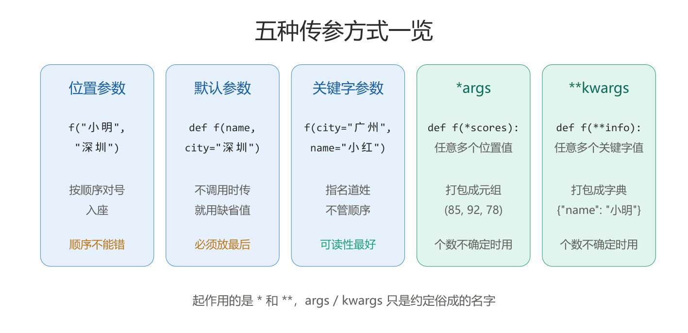

<sub>[返回目录](#top)</sub>

---

<a id="s53"></a>

## 5.3　返回值、作用域、闭包入门

### 5.3.1　返回值：函数办完事，交回一个结果

`print` 是"把结果显示给人看"，`return` 是"把结果交还给调用处，让程序接着用"。

```python
def average(scores):
    return sum(scores) / len(scores)

avg = average([85, 92, 78])     # return 的值被 avg 接住
print(avg + 5)                  # 90.0：结果可以继续参与运算
```

几个要点：

- `return` 之后的函数体**不再执行**——`return` 既交回结果，也结束函数。
- 不写 `return`，函数默认返回 `None`。这就是之前 `print(map(...))` 打印出 `<map object ...>` 之外、`print(列表.sort())` 打印出 `None` 的原因。
- `return a, b` 可以一次交回多个值（其实是打包成元组），调用处用多个变量接住：

```python
def min_max(scores):
    return min(scores), max(scores)

lo, hi = min_max([85, 92, 78])
print(lo, hi)     # 78 92
```

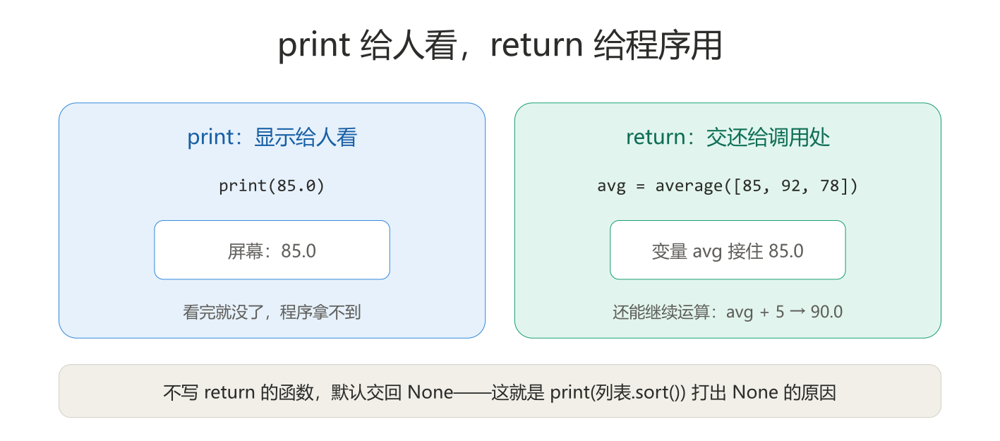

### 5.3.2　变量作用域：函数里的变量，出了门就不认

**在函数内部定义的变量叫局部变量，只在函数内部有效**；函数执行完，它们就消失了：

```python
def average(scores):
    total = sum(scores)         # total 是局部变量
    return total / len(scores)

print(average([85, 92, 78]))
# print(total)                  # 报错！外面根本没有 total 这个名字
```

反过来，函数**里面可以读到外面**定义的变量（全局变量），但想在里面**改**它，要用 `global` 声明：

```python
count = 0                  # 全局变量

def add_one():
    global count           # 声明：我要改的是外面那个 count
    count = count + 1

add_one()
add_one()
print(count)               # 2：外面那个 count 真的被改了
```

如果去掉 `global count` 那一行，`count = count + 1` 会被当成**新建一个同名的局部变量**——外面的 `count` 纹丝不动，而且还会因为"局部变量还没赋值就被使用"直接报错。

既然能改，为什么不建议用？因为全局变量可以被**任何一个函数**悄悄改掉——程序一大，出了问题你根本不知道该去哪个函数里查。初学阶段的经验法则：**函数要什么，通过参数传进去；函数给什么，通过 return 交回来**，尽量不碰外面的变量。`global` 的写法见到认识即可，自己的代码里先别用。

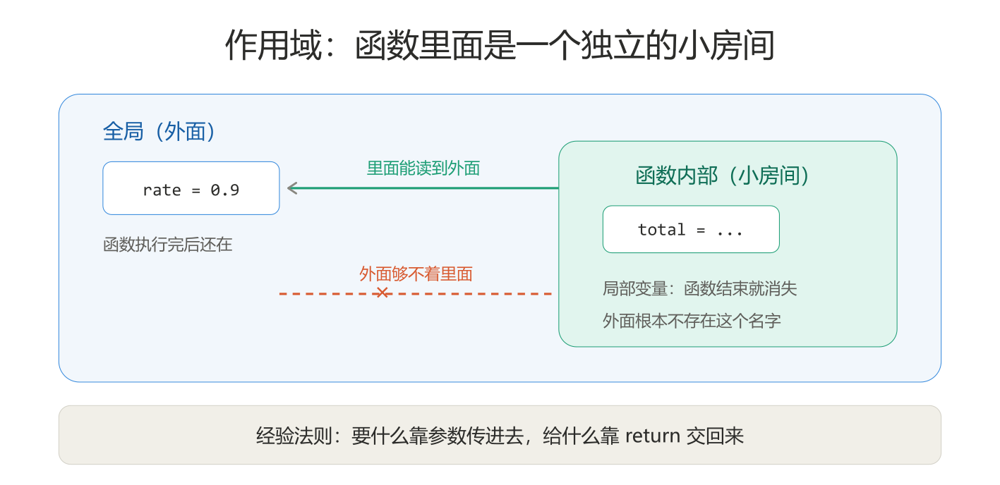

### 5.3.3　闭包入门

理解三个小概念（其实很基础，也学习过了）

**函数也是一种值，可以装进变量。**

```python
def hello():
    print("你好")

f = hello     # 注意没加括号：不是调用，是把函数这个"值"赋给 f
f()           # 你好：f 和 hello 指的是同一个函数
```

函数和数字、列表一样，是一种可以传来传去的值。这是理解后面一切的基础。

**函数里可以定义函数，里层的能读到外层的变量。**

```python
def outer():
    n = 5
    def add(x):
        return x + n     # add 是 outer 的"内部人员"，读得到 n
    print(add(10))

outer()     # 15
```

按 5.3.2 的作用域规则，里层往外看本来就没问题——这一步没什么问题，但是看看下一步。

**零件三：把里层函数 return 出来，它会"带走"当时的 n。**

```python
def make_adder(n):
    def add(x):
        return x + n
    return add           # 注意：return 的是 add 本身，没加括号

add5 = make_adder(5)     # add5 拿到的就是那个 add 函数（因为写的很清楚：return add，返回的是函数，无论你传入的是什么）
print(add5(10))          # 15
```

把上面两行调用，一步一步看：

**第一步：`add5 = make_adder(5)`——造出一个"带着 5 的函数"**

1. 进入 `make_adder`，形参 `n` 领到值 5；
2. 执行 `def add(x):`——注意这一步只是**定义** `add`，还不运行它。但 `add` 在定义时就"看见"了外层的 `n = 5`，并把它记住了；
3. 执行 `return add`——把 `add` 这个函数本身交出去，赋给了 `add5`；
4. `make_adder` 执行完毕。按 5.3.2 的规则，局部变量 `n` 本该被销毁——但因为 `add` 函数还要用它，Python 会让 `n` 继续活着，只是藏起来了，**只有 `add5` 够得着它**。

**第二步：`print(add5(10))`——用这个函数**

1. 调用 `add5`，也就是调用当初那个 `add`，形参 `x` 领到值 10。（你调用了 add5 函数也就是调用了 make_adder 函数的返回值 add 函数，那么也就是运行了 make_adder 里面的 add 函数）；
2. 函数体是 `return x + n`：`x` 是刚传进来的 10，`n` 是当初带走的 5；
3. 算出 15，打印出来。

**这就是闭包：里层函数被送出去的时候，把它"出生时"用到的外层变量一起打包带走了。** `n` 没有消失，它跟着 `add5` 活了下来。

而且每调一次 `make_adder`，就造出**一个独立的包裹**（所以叫做“闭包”），各记各的：

```python
def make_adder(n):
    def add(x):
        return x + n
    return add           # 注意：return 的是 add 本身，没加括号

add5 = make_adder(5)
add10 = make_adder(10)
print(add5(1))      # 6：这个包裹里 n 是 5
print(add10(1))     # 11：这个包裹里 n 是 10
```

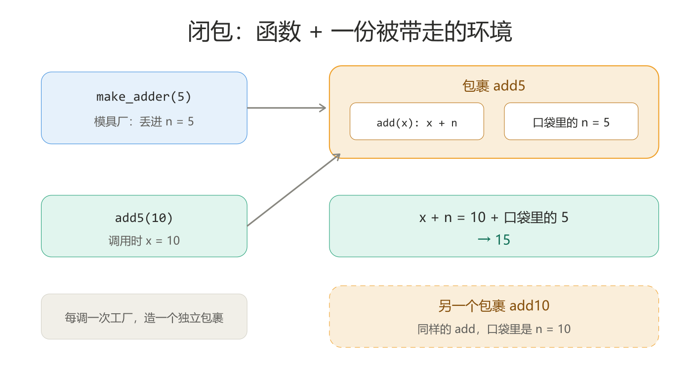

**这有什么用？** 它是一种"定制函数"的办法：`make_adder` 像个模具厂——丢给它 5，造出一个"永远加 5 的函数"；丢给它 10，造出一个"永远加 10 的函数"。

初学阶段当然了解即可。

<sub>[返回目录](#top)</sub>

---

<a id="s54"></a>

## 5.4　Lambda 与高阶函数

### 5.4.1　lambda：一句话定义的小函数

有些函数小到只有一行，专门为它写 `def` 有点隆重，`lambda` 可以就地定义：

```python
double = lambda x: x * 2
print(double(5))     # 10
```

`lambda 参数: 表达式` 等价于：

```python
def double(x):
    return x * 2
```

lambda 只适合"一行能写完"的简单逻辑，复杂的还是老实写 `def`。

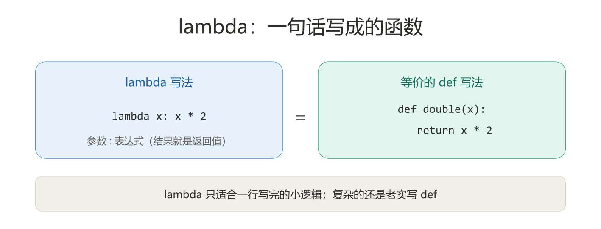

### 5.4.2　高阶函数：把函数当参数传

**参数里能传函数的函数，叫高阶函数。** 最常用的是 `sorted` 的 `key` 参数——它告诉排序"按什么比"：

```python
students = [
    {"name": "小明", "score": 85},
    {"name": "小红", "score": 92},
    {"name": "小刚", "score": 78},
]
ranked = sorted(students, key=lambda s: s["score"], reverse=True)
for s in ranked:
    print(s["name"], s["score"])
# 小红 92
# 小明 85
# 小刚 78
```

`key=lambda s: s["score"]` 的意思是：排序前，先把每个元素拿给这个小函数过一遍，**按返回的值来比**。这里每个元素是字典，返回的是它的 `"score"`，于是就按分数排了。

`lambda s: s["score"]` 拆开读——就是 5.4.1 那个格式 `lambda 参数: 表达式`，只不过参数和表达式都换了内容：

- **`s` 是形参**：`sorted` 每次把**一个元素**塞进 `s`。这里的元素是字典，所以某一次 `s` 就是 `{"name": "小明", "score": 85}`；
- **冒号后面的 `s["score"]` 是返回的表达式**：对这个字典按键 `"score"` 取值——就是第 4 节学的字典取值，这一次取出 85。

所以它和下面这个函数完全等价：

```python
def get_score(s):
    return s["score"]
```

`sorted` 对三个元素各调用一次，依次拿到 85、92、78，**按这三个数比大小**，元素本身原样跟着排：

| 第几次 | `s` 拿到                        | `s["score"]` 返回 |
| :----- | :------------------------------ | :---------------- |
| 1      | `{"name": "小明", "score": 85}` | 85                |
| 2      | `{"name": "小红", "score": 92}` | 92                |
| 3      | `{"name": "小刚", "score": 78}` | 78                |

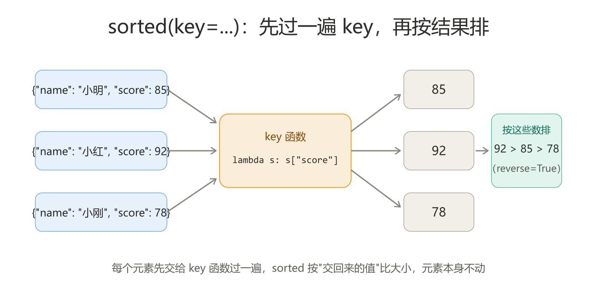

### 5.4.3　重新认识 map 与 filter

第 4 节留下一个伏笔：`map`/`filter` 配合自己定义的规则会更灵活。现在规则可以自己写了：

```python
scores = [85, 92, 78, 90]

# map + lambda：每个分数换算成 10 分制
print(list(map(lambda s: s / 10, scores)))
# [8.5, 9.2, 7.8, 9.0]

# filter + lambda：只留下及格的
print(list(filter(lambda s: s >= 80, scores)))
# [85, 92, 90]
```

当年"`map(str, nums)` 里写 `str` 不写 `str()`"的规矩，现在彻底明白了：**传给高阶函数的是"一个动作"，动作本身也是值**——`str`、自己 `def` 的函数名、`lambda` 表达式，都是同一种东西。

<sub>[返回目录](#top)</sub>

---

<a id="s55"></a>

## 5.5　常用内置函数与递归入门

### 5.5.1　常用内置函数速览

Python 自带的这批函数不用 import，直接用。大部分都见过，这里集中补几个常用的：

| 函数            | 作用                     | 示例                              |
| :-------------- | :----------------------- | :-------------------------------- |
| `abs(x)`        | 绝对值                   | `abs(-3)` → `3`                   |
| `round(x, n)`   | 四舍五入保留 n 位小数    | `round(3.14159, 2)` → `3.14`      |
| `max` / `min`   | 最大 / 最小值            | `max([3, 1, 4])` → `4`            |
| `sum(列表)`     | 求和                     | `sum([1, 2, 3])` → `6`            |
| `sorted(列表)`  | 返回排好序的**新**列表   | `sorted([3, 1, 2])` → `[1, 2, 3]` |
| `len(容器)`     | 元素个数                 | `len("abc")` → `3`                |
| `type(x)`       | 查看类型                 | `type(3.5)` → `<class 'float'>`   |
| `int/str/float` | 类型转换                 | `int("85")` → `85`                |
| `range(n)`      | 生成 0 到 n-1 的整数序列 | `list(range(3))` → `[0, 1, 2]`    |

注意区分：`sorted(列表)` **返回新列表**，原列表不变；`列表.sort()` 是**原地排序**，返回 `None`。混用是经典 bug：

```python
nums = [3, 1, 2]
a = sorted(nums)      # a 是 [1, 2, 3]，nums 还是 [3, 1, 2]
b = nums.sort()       # nums 变成 [1, 2, 3]，但 b 是 None！
```

### 5.5.2　递归入门：函数调用自己

**递归 = 函数在执行过程中调用自己。** 经典例子是倒计时：

```python
def countdown(n):
    if n <= 0:
        print("点火！")
        return
    print(n)
    countdown(n - 1)     # 自己调用自己，但数字变小了

countdown(3)
# 3
# 2
# 1
# 点火！
```

写递归的两个必备条件，缺一不可：

1. **基例（结束条件）**：什么时候不再调用自己（上面是 `n <= 0`）。没有它，函数会无限自我调用直到报错。
2. **向基例靠近**：每次调用，问题规模要变小（上面是 `n - 1`）。

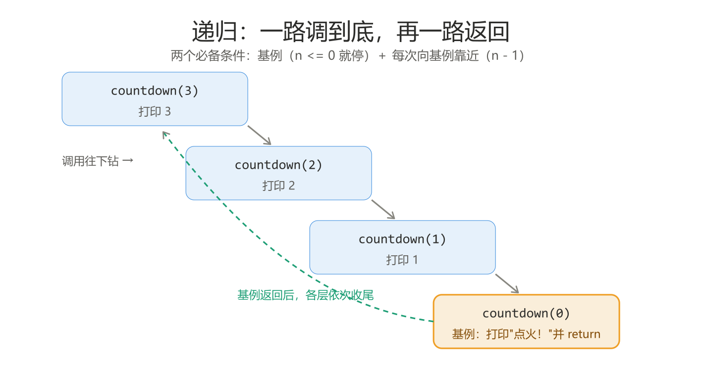

递归的用处是把"大问题拆成一模一样的更小问题"。初学阶段**能读懂、会写倒计时这种程度的就够**——大部分场景用循环也能解决，而且循环往往更直观。
（虽然但是，这个递归是面试必考题）

<sub>[返回目录](#top)</sub>

---

<a id="s56"></a>

## 5.6　模块（包/库）与 import

### 5.6.1　模块（包/库）：别人写好的工具箱

**模块 = 一个现成的 `.py` 文件，里面装好了一组函数。** Python 自带一大批（标准库），用 `import` 搬进来就能用。三种常见写法：

```python
import random              # 整个搬进来：用的时候写 random.randint(...)
print(random.randint(1, 10))

from math import sqrt      # 只搬指定的一件：直接用 sqrt(...)
print(sqrt(16))            # 4.0

import datetime as dt      # 搬进来并起个短名：dt.xxx
print(dt.date.today())
```

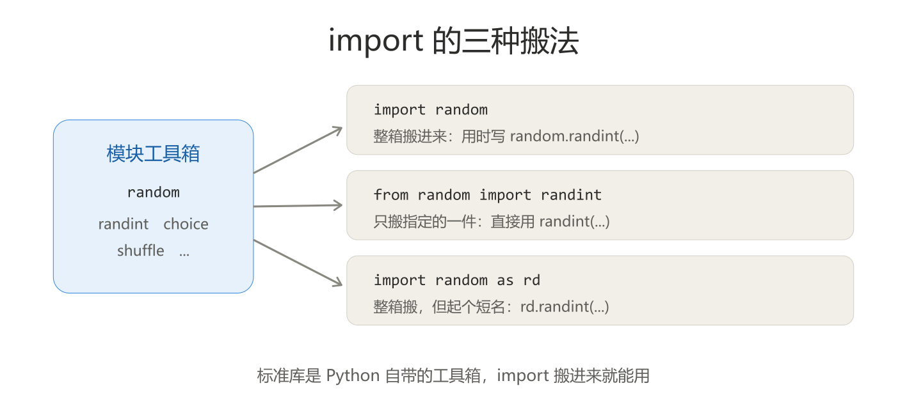

### 5.6.2　四个最常用的标准库

**`random`：随机数**

```python
import random

print(random.randint(1, 100))              # 1~100 的随机整数
print(random.choice(["苹果", "香蕉"]))     # 随机挑一个
cards = [1, 2, 3, 4, 5]
random.shuffle(cards)                      # 原地打乱顺序
print(cards)
```

**`time`：时间**

```python
import time

print(time.time())          # 时间戳：从 1970 年至今的秒数
time.sleep(1)               # 程序暂停 1 秒
```

**`math`：数学**

```python
import math

print(math.sqrt(16))        # 4.0：平方根
print(math.pi)              # 3.141592...
print(math.ceil(4.2))       # 5：向上取整
```

**`os`：和操作系统打交道（看文件）**

```python
import os

print(os.getcwd())          # 当前工作目录
print(os.listdir("."))      # 当前目录下的文件列表
```

<sub>[返回目录](#top)</sub>

---

<a id="s57"></a>

## 5.7　第三方包：pip 与 requests

标准库是 Python 自带的，**第三方包是全世界程序员写好、发布出去的模块**，用 `pip` 安装。安装一次，以后 `import` 就能用：

```bash
pip install requests
```

> 在 PyCharm 里可以在下方的 Terminal（终端）窗口直接运行这条命令。

`requests` 是最著名的第三方包之一，用来**发网络请求**——你的程序可以像浏览器一样去访问一个网址，把内容拿回来：

```python
import requests

resp = requests.get("https://api.github.com")
print(resp.status_code)     # 200：请求成功（404 是找不到，500 是对方出错）
print(resp.text[:100])      # 返回内容的前 100 个字符
```

程序运行时会真的去访问网络，所以要联网才能跑通。拿到的是文本；如果对方返回的是 JSON（一种"长得像 Python 字典"的数据格式），还能一步转成字典接着取值：

```python
import requests

resp = requests.get("https://api.github.com/users/octocat")
data = resp.json()                    # 返回内容转成字典
print(data["login"])                  # octocat
print(data.get("name", "无名氏"))     # 字典的 get 在这里照样用
```

后端开发的日常，很大一部分就是"接收请求、返回数据"——先学会**当请求的发起方**，后面写服务端时就知道对方在干嘛了。

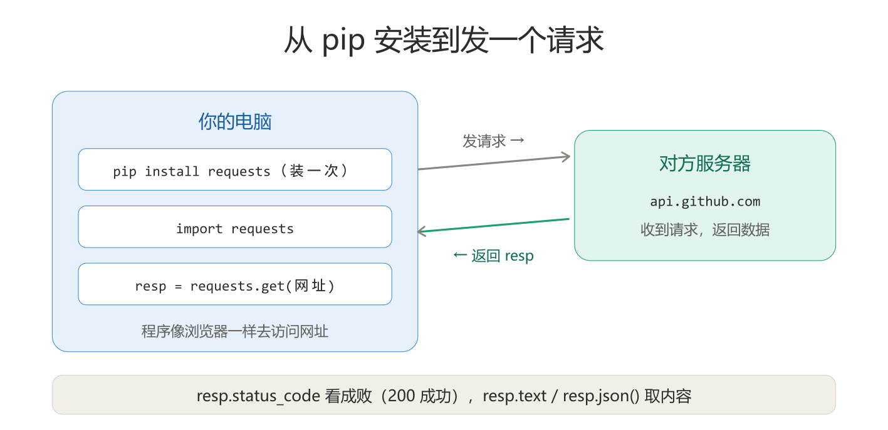

<sub>[返回目录](#top)</sub>

---

<a id="s58"></a>

## 5.8　实战：成绩统计工具箱

综合运用本节内容：把 4.6 的"一个脚本从头写到尾"升级成**按功能拆成函数**的程序。每个统计动作一个函数，主菜单负责调度：

```python
def input_scores():
    texts = input("请输入成绩，用空格分隔：").split()
    return list(map(int, texts))

def average(scores):
    return sum(scores) / len(scores)

def pass_rate(scores):
    passed = list(filter(lambda s: s >= 60, scores))
    return len(passed) / len(scores) * 100

def report(scores):
    print(f"人数：{len(scores)}")
    print(f"平均分：{average(scores):.1f}")
    print(f"最高分：{max(scores)}，最低分：{min(scores)}")
    print(f"及格率：{pass_rate(scores):.0f}%")

def main():
    scores = []
    while True:
        print("\n===== 成绩统计工具箱 =====")
        print("1. 录入成绩")
        print("2. 查看统计")
        print("3. 退出")
        choice = input("请选择操作（1-3）：")

        if choice == "1":
            scores = input_scores()
            print(f"已录入 {len(scores)} 条成绩")
        elif choice == "2":
            if len(scores) == 0:
                print("请先录入成绩")
            else:
                report(scores)
        elif choice == "3":
            print("再见！")
            break
        else:
            print("输入无效，请输入 1-3")

main()
```

运行示例：

```
===== 成绩统计工具箱 =====
1. 录入成绩
2. 查看统计
3. 退出
请选择操作（1-3）：1
请输入成绩，用空格分隔：85 92 78 55 90
已录入 5 条成绩
请选择操作（1-3）：2
人数：5
平均分：80.0
最高分：92，最低分：55
及格率：80%
```

注意这个结构和 4.6 通讯录的区别：**每个功能都有了自己的名字**。`report` 里调用 `average`、`pass_rate`，`main` 只管菜单——想知道"及格率怎么算的"，直接去看 `pass_rate` 那三行就行，不用在一大段代码里翻。这就是函数带来的可维护性。

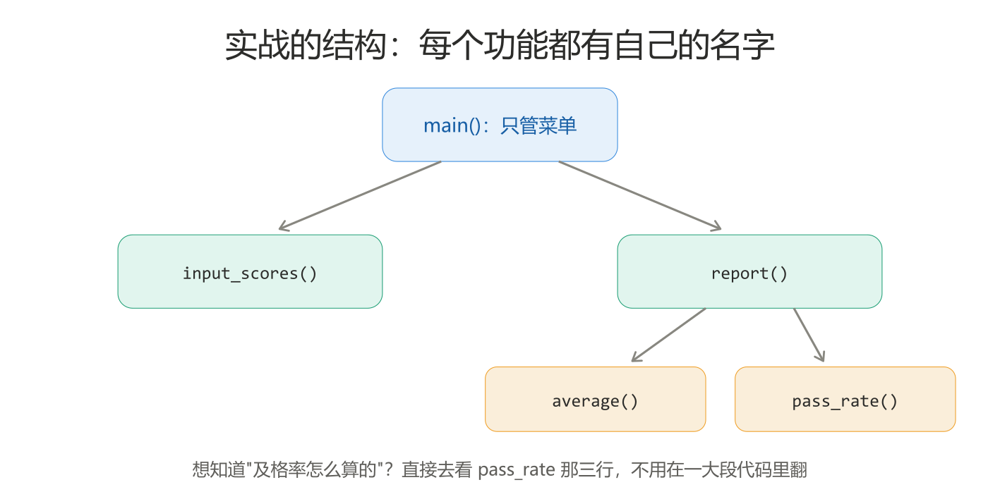

> 本节配套代码见 [`code/part1_python/section5/`](../../code/part1_python/section5/)，也可以打开整节的交互式笔记本 [section5.ipynb](../../code/part1_python/section5/section5.ipynb)，边看讲解边逐格运行：
> [01_function_basics.py](../../code/part1_python/section5/01_function_basics.py)（定义与调用）·
> [02_params.py](../../code/part1_python/section5/02_params.py)（五种参数）·
> [03_return_scope.py](../../code/part1_python/section5/03_return_scope.py)（返回值/作用域/闭包）·
> [04_lambda_hof.py](../../code/part1_python/section5/04_lambda_hof.py)（lambda 与高阶函数）·
> [05_builtins_recursion.py](../../code/part1_python/section5/05_builtins_recursion.py)（内置函数与递归）·
> [06_modules.py](../../code/part1_python/section5/06_modules.py)（标准库）·
> [07_requests_demo.py](../../code/part1_python/section5/07_requests_demo.py)（第三方包）·
> [08_practice_scores.py](../../code/part1_python/section5/08_practice_scores.py)（成绩统计工具箱）·
> [09_type_hints.py](../../code/part1_python/section5/09_type_hints.py)（类型提示）

<sub>[返回目录](#top)</sub>

---

<a id="s59"></a>

## 5.9　类型提示：给数据贴上"品种标签"

### 5.9.1　为什么需要类型提示

Python 是"动态类型"：变量本身没有固定品种，`x = 5` 之后还能 `x = "abc"`，解释器都不拦。小脚本里这是灵活，代码一多就变成糊涂账——**这个变量到底该装什么？**

类型提示（type hints）就是给变量、参数、返回值贴上"应该装什么"的标签：

```python
age: int = 18
name: str = "小明"
scores: list = [85, 92, 78]
```

**最重要的一句话：标签不影响运行。** 就算标了 `int` 却赋一个字符串，Python 也照跑不误——它不是检查，是提示。那为什么要标？两个好处：

1. **读代码的人**（包括三个月后的你）一眼就知道每个名字该装什么，不用猜。
2. **PyCharm 会按标签干活**：补全更准；赋的值和标签对不上时，编辑器当场画波浪线，不用等运行出错。

### 5.9.2　各种类型怎么写

**基本类型直接用名字：**

```python
count: int = 3
price: float = 9.9
name: str = "小明"
is_active: bool = True
```

**容器可以只写品种，也可以写清"里面装什么"：**

```python
scores: list = [85, 92, 78]              # 只标"是个列表"
scores: list[int] = [85, 92, 78]         # 标清"装整数的列表"（更推荐）

prices: dict[str, float] = {"苹果": 3.5, "香蕉": 2.8}
point: tuple[int, int] = (3, 5)
tags: set[str] = {"python", "sql"}
```

嵌套结构就一层层写下去，和第 4 节的嵌套取值正好对应：

```python
students: list[dict[str, int]] = [{"score": 85}, {"score": 92}]
# 读法：一个列表，里面每个元素是"键为字符串、值为整数"的字典
```

**一个名字允许装几种类型，用 `|` 连起来；允许"没有值"就加上 `None`：**

```python
user_input: str | None = None      # 可能是字符串，也可能还没填
score: int | float = 92            # 整数小数都行
```

### 5.9.3　函数上的类型提示

函数标注写在签名上：**参数后面 `: 类型`，括号后面 `-> 返回值类型`**：

```python
def average(scores: list[int], passing: int = 60) -> float:
    passed = [s for s in scores if s >= passing]
    return sum(passed) / len(passed)

print(average([85, 92, 55, 78]))
```

默认参数、`*args`、`**kwargs` 照样能标：

```python
def show_info(**info: str) -> None:
    for key, value in info.items():
        print(f"{key}: {value}")

show_info(name="小明", city="深圳")
```

`-> None` 表示这个函数不返回有用的结果（比如只负责打印）。

<sub>[返回目录](#top)</sub>

---

<a id="summary"></a>

## 本节小结

**函数基础**

- 函数 = 给一段动作起名字：定义用 `def`，调用喊名字；先定义后调用。
- 参数五种传法：位置（对号入座）、默认（`形参=默认值`，放最后）、关键字（`名=值`，不管顺序）、`*args`（多个位置值打包成元组）、`**kwargs`（多个关键字值打包成字典）。
- 类型提示：`变量: 类型`、容器写细 `list[int]` / `dict[str, float]`、函数标 `def f(x: int) -> float`；允许几种类型用 `int | float`，允许空用 `str | None`。**不影响运行**，给人和编辑器看；PyCharm 会据此补全并对类型不匹配画波浪线。
- `return` 交回结果并结束函数；不写返回 `None`。`return a, b` 可交回多个值。

**进阶概念**

- 局部变量只在函数内有效；函数要什么靠参数传、给什么靠 return 交。
- 函数也是一种值：可以赋给变量、当参数传、当结果返回——闭包、lambda、高阶函数都靠这一条。
- `lambda 参数: 表达式` 定义一行小函数；`sorted(key=...)`、`map`、`filter` 是常用高阶函数。
- 递归 = 函数调用自己，必须有基例、且每次向基例靠近。

**模块与包**

- `import random` / `from math import sqrt` / `import datetime as dt` 三种写法。
- 标准库常用：`random`、`time`、`math`、`os`；第三方包用 `pip install` 装，`requests` 发网络请求，`resp.json()` 一步转字典。

下一节：面向对象编程（OOP）。

<sub>[返回目录](#top)</sub>
