<a id="top"></a>

# Section 6　面向对象编程（OOP）

---

## 本节导航

| 序号 | 主题                                                |
| :--: | :-------------------------------------------------- |
| 6.1  | [面向对象思想：为什么要用类](#s61)                  |
| 6.2  | [类与对象、`__init__`、`self`](#s62)                |
| 6.3  | [实例属性 vs 类属性、实例方法](#s63)                |
| 6.4  | [封装：`_x` / `__x` / `@property`](#s64)            |
| 6.5  | [继承、`super()` 与方法重写](#s65)                  |
| 6.6  | [多态：同一句话，各自理解](#s66)                    |
| 6.7  | [魔术方法：`__str__` / `__repr__` / `__eq__`](#s67) |
| 6.8  | [实战：银行账户系统](#s68)                          |
|  —   | [本节小结](#summary)                                |

---

<a id="s61"></a>

## 6.1　面向对象思想：为什么要用类

### 6.1.1　先回顾一下我们现有的工具

学到第 5 节，组织代码的工具有两个：

- **容器**（第 4 节）：把多个**数据**装在一起——`{"name": "小明", "balance": 1000}`；
- **函数**（第 5 节）：把多个**动作**打包——`deposit(account, amount)`。

但它们俩是**分离**的：数据在一边，操作数据的函数在另一边。拿"银行账户"来说：

```python
# 数据：一个字典
account = {"owner": "小明", "balance": 1000}

# 动作：一堆游离的函数，靠参数把数据传进去
def deposit(account, amount):
    account["balance"] += amount

def withdraw(account, amount):
    account["balance"] -= amount

deposit(account, 500)
print(account["balance"])     # 1500
```

能跑，但隐患不少：

- 谁知道 `account` 这个字典里到底该有哪些键？`"balance"` 写错成 `"balanse"`，运行时才炸。
- `withdraw` 忘了判断余额够不够，直接变负数——**数据是敞开的，谁都能随便改**。
- 账户一多，哪些函数是管账户的、哪些是管别的，全靠命名自觉。

### 6.1.2　面向对象：把"数据"和"动作"装进同一个东西

面向对象的核心想法就一句话：**现实中的一个"东西"，既带着它的数据，也带着它能做的动作——那就把这两样装进同一个"对象"里。**

还是银行账户，用对象的方式想：

- 一个账户**有**：户主、余额（数据，叫**属性**）；
- 一个账户**能**：存钱、取钱（动作，叫**方法**）。

```python
class Account:
    def __init__(self, owner, balance):
        self.owner = owner
        self.balance = balance

    def deposit(self, amount):
        self.balance += amount

acc = Account("小明", 1000)     # 造出一个账户对象
acc.deposit(500)                # 让它存钱
print(acc.balance)              # 1500
```

`class` 是**类**——一张"图纸"，规定账户这种东西有什么数据、能做什么；`acc` 是**对象**（也叫实例）——按图纸造出来的一个具体账户。数据和动作从此长在同一个东西上：`acc.balance` 是它的钱，`acc.deposit(...)` 是它的本事，一眼就知道它们是一伙的。

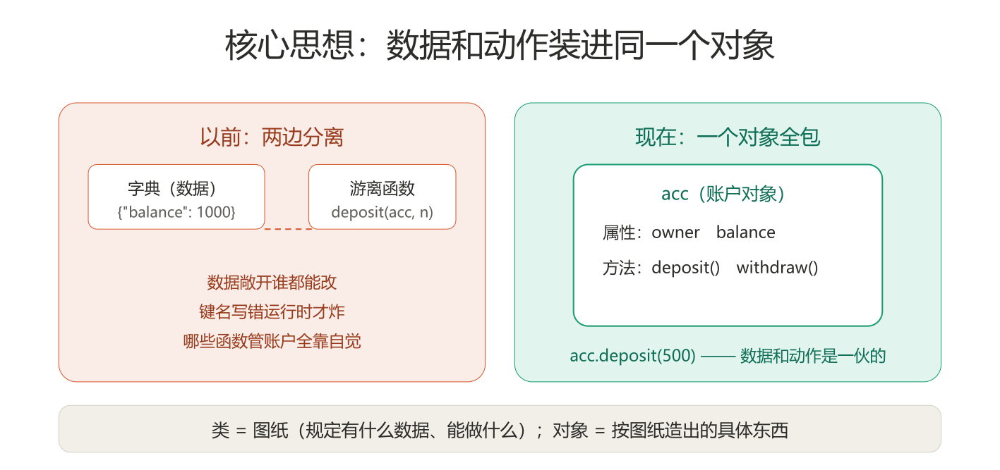

### 6.1.3　OOP 的三大特性

围绕"把东西装进对象"这个核心，OOP 发展出三个著名特性，也是本节后半的路线图：

| 特性     | 一句话                                     | 在哪节 |
| :------- | :----------------------------------------- | :----- |
| **封装** | 数据藏好，只留安全的操作入口，不让外面乱改 | 6.4    |
| **继承** | 新类基于旧类造，现成的代码直接拿来用       | 6.5    |
| **多态** | 同一个指令，不同的对象各自用各自的方式执行 | 6.6    |

先记住这三个词。学到 6.6 时回头看，它们其实都在回答同一个问题：**怎么让代码像现实世界的"东西"一样，好懂、好管、好扩展。**

接下来 6.2 会正式开写类。先用一张图认全类的每个零件，后面每节都是在放大其中一个：

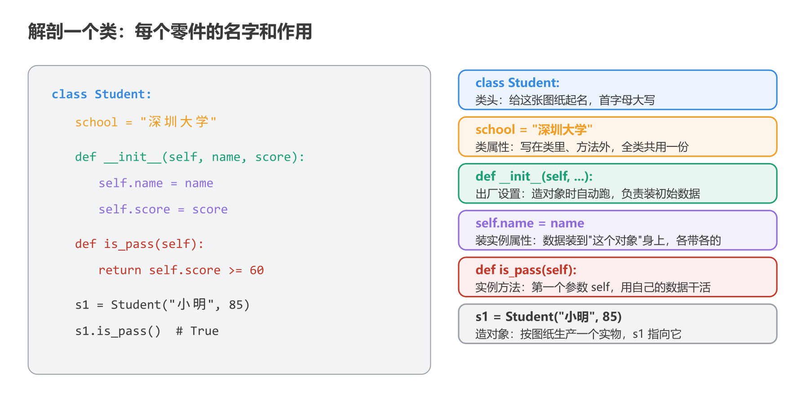

<sub>[返回目录](#top)</sub>

---

<a id="s62"></a>

## 6.2　类与对象、`__init__`、`self`

### 6.2.1　类是图纸，对象是实物

```python
class Student:
    pass                     # 暂时什么都不写，pass 占位

s1 = Student()               # 按图纸造出一个对象
s2 = Student()               # 再造一个，它和 s1 是两个独立的东西
print(type(s1))              # <class '__main__.Student'>
```

- **定义类**：`class 类名:`，类名约定**首字母大写**（`Student`、`Account`），这是和变量名区分的标志。
- **造对象**：`类名()`——看着像调用函数，其实是在"按图纸生产"，每调一次造出一个新对象。

### 6.2.2　`__init__`：出厂时装好初始数据

空图纸没用，造出来的时候总得给它装上数据。`__init__` 就是**出厂设置**——每次 `类名(...)` 造对象时自动执行：

```python
class Student:
    def __init__(self, name, score):
        self.name = name       # 把传进来的 name 装到这个对象身上
        self.score = score

s1 = Student("小明", 85)
s2 = Student("小红", 92)
print(s1.name, s1.score)     # 小明 85
print(s2.name, s2.score)     # 小红 92
```

`Student("小明", 85)` 括号里的值，就是传给 `__init__` 的（`self` 不用你传，见下）。整件事分三步：

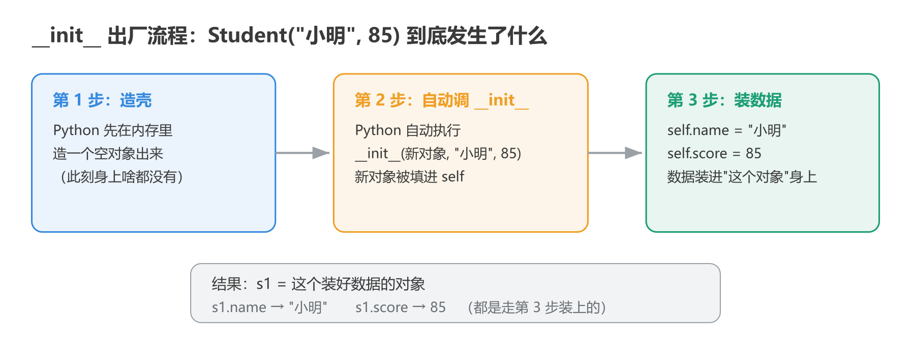

### 6.2.3　`self`：这个对象自己

`self` 是初学 OOP 最绕的一个词，其实规则很机械：

**定义方法时，第一个参数永远写 `self`；调用方法时，Python 自动把"这个对象本身"填进 `self`，不用你管。**

```python
class Student:
    def __init__(self, name, score):
        self.name = name
        self.score = score

    def introduce(self):           # 定义时写 self
        print(f"我是{self.name}，考了{self.score}分")

s1 = Student("小明", 85)
s1.introduce()     # 我是小明，考了85分
```

走一遍 `s1.introduce()`：Python 看到 `s1.` 开头，就自动把 `s1` 塞进 `introduce` 的第一个参数——`self` 就是 `s1`。所以 `self.name` 就是"s1 自己身上装的那个 name"。

`self.xxx` 的读写都发生在**这个对象自己**身上：`s1` 和 `s2` 各有各的 `name`，互不干扰——这就是"对象各自独立"的含义。

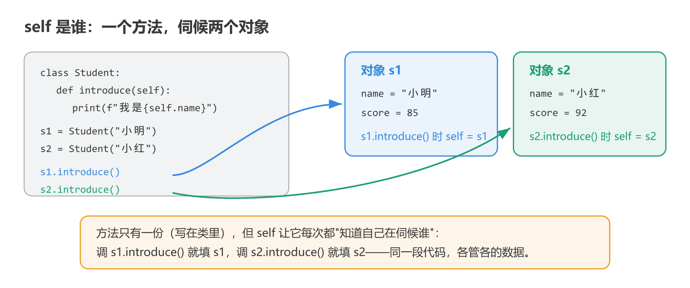

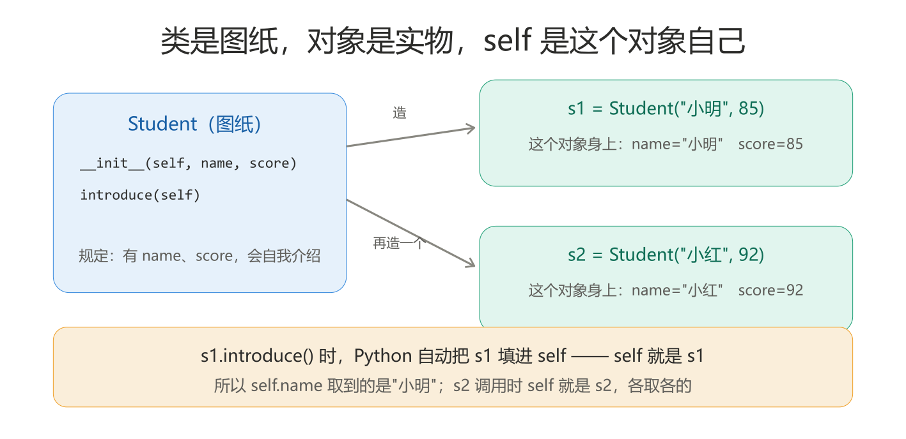

<sub>[返回目录](#top)</sub>

---

<a id="s63"></a>

## 6.3　实例属性 vs 类属性、实例方法

### 6.3.1　两种属性：各带各的 vs 大家共用的

**实例属性**：装在每个对象自己身上（`self.xxx`），各自独立——上面 `s1.name`、`s2.name` 都是。

**类属性**：写在类里、所有方法外面，**全类共用一份**：

```python
class Student:
    school = "深圳大学"        # 类属性：所有学生共用

    def __init__(self, name):
        self.name = name       # 实例属性：每个学生各带各的

s1 = Student("小明")
s2 = Student("小红")
print(s1.school, s2.school)     # 深圳大学 深圳大学（共用同一份）
print(Student.school)           # 深圳大学（通过类也能访问）
```

区别一句话：**实例属性"每个对象一份"，类属性"全类一份"**。大家一样的信息（学校名、院系名）放类属性；各不相同的（名字、成绩）放实例属性。

那 `s1.school` 明明不是 `s1` 自己的，Python 是怎么找到的？**先翻对象自己的包，没找到再去类里翻**：

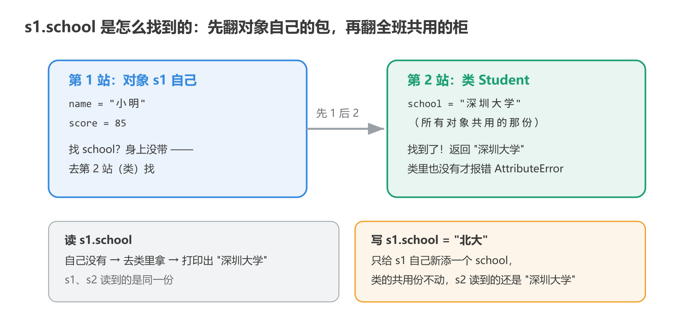

### 6.3.2　实例方法：第一个参数是 self 的方法

6.2 里的 `introduce` 就是**实例方法**——第一个参数是 `self`，操作的是"这个对象自己"的数据。这是最常用的方法类型，前面写的全是它。

```python
class Student:
    school = "深圳大学"

    def __init__(self, name, score):
        self.name = name
        self.score = score

    def is_pass(self):            # 实例方法：用自己的数据判断
        return self.score >= 60

s = Student("小明", 85)
print(s.is_pass())     # True
```

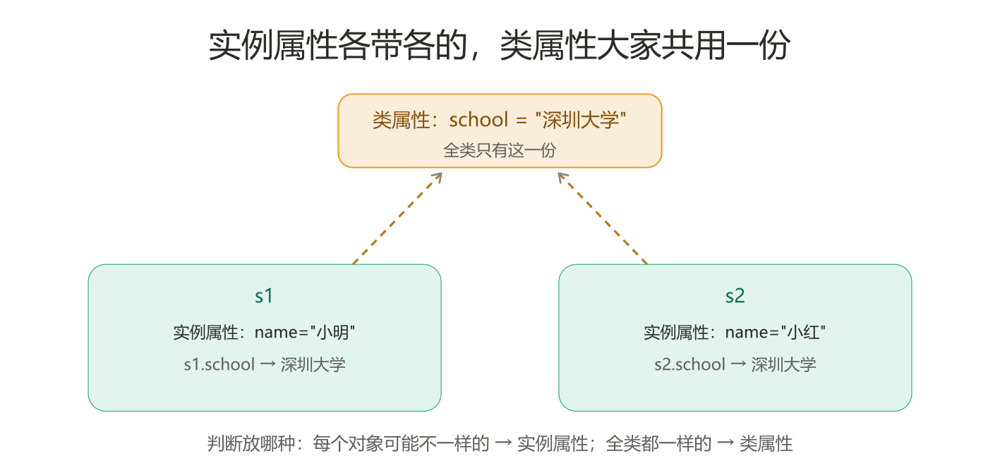

<sub>[返回目录](#top)</sub>

---

<a id="s64"></a>

## 6.4　封装：`_x` / `__x` / `@property`

### 6.4.1　问题：数据是敞开的

回到银行账户的隐患：

```python
class Account:
    def __init__(self, owner, balance):
        self.owner = owner
        self.balance = balance

acc = Account("小明", 1000)
acc.balance = -99999     # 直接改余额？银行要破产了
```

**封装的思想：数据不该让外面随便摸，只留几个安全的操作入口（方法），规则写在入口里。**

### 6.4.2　两道防线：`_x` 和 `__x`

**单下划线 `_x`：约定俗成的"内部使用，请勿直接碰"**。Python 不拦你，但看到 `_` 开头的名字，懂规矩的人就不该动它：

```python
class Account:
    def __init__(self, owner, balance):
        self.owner = owner
        self._balance = balance     # 约定：这是内部数据，别直接改
```

**双下划线 `__x`：Python 帮你藏得更深**——名字会被改写成 `_Account__balance`，从外面写 `acc.__balance` 直接访问不到：

```python
class Account:
    def __init__(self, owner, balance):
        self.owner = owner
        self.__balance = balance    # 藏得更深的内部数据

    def deposit(self, amount):
        self.__balance += amount    # 类内部自己可以用

    def get_balance(self):
        return self.__balance       # 想看？走这个入口

acc = Account("小明", 1000)
acc.deposit(500)
print(acc.get_balance())     # 1500
# print(acc.__balance)       # 报错：外面访问不到
```

为什么外面访问不到？因为 Python 把类里写的 `__balance` **偷偷改了名**：

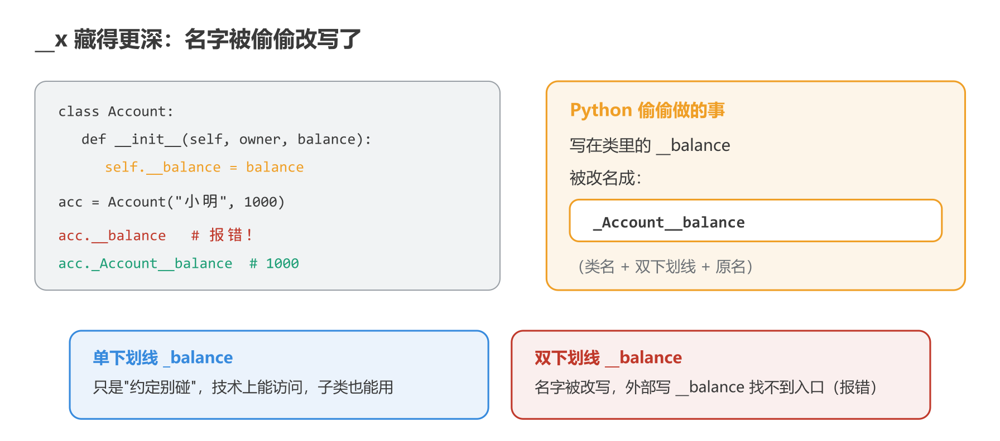

### 6.4.3　`@property`：把方法伪装成属性

`get_balance()` 每次都要写括号，别扭。`@property` 让方法**看起来像普通属性**，但取值时实际走的是你写的逻辑：

```python
class Account:
    def __init__(self, owner, balance):
        self.owner = owner
        self.__balance = balance

    @property
    def balance(self):
        return self.__balance       # 读 acc.balance 时实际执行这里

acc = Account("小明", 1000)
print(acc.balance)     # 1000：像属性一样读，没括号
# acc.balance = -1     # 报错：没提供写的入口，改不了
```

读 `acc.balance` 时实际走的路：

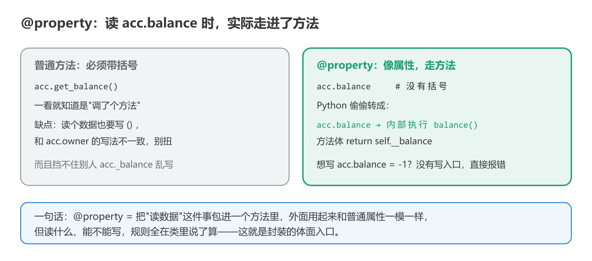

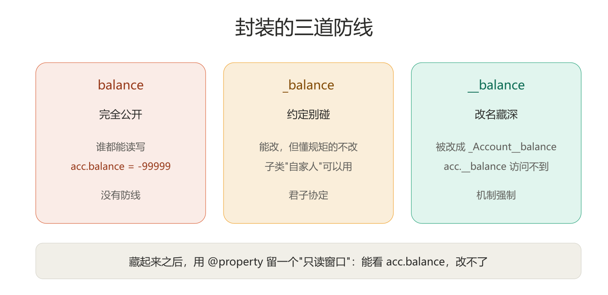

封装收拢成一句话：**`__` 把数据藏好，`@property` 留个体面的读取入口，想改？走我写的方法，规则我说了算。**

<sub>[返回目录](#top)</sub>

---

<a id="s65"></a>

## 6.5　继承、`super()` 与方法重写

### 6.5.1　继承：新类站在旧类肩膀上

要做一个"储蓄账户"和"信用卡账户"——它们都有户主、余额、存取，只是取钱规则不同。难道把 `Account` 抄两遍？**继承：新类基于旧类造，旧类的属性方法直接拥有**：

```python
class Account:
    def __init__(self, owner, balance):
        self.owner = owner
        self.balance = balance

    def deposit(self, amount):
        self.balance += amount

class CreditAccount(Account):     # 括号里写旧类名：继承它
    pass

acc = CreditAccount("小明", 1000)     # 没写 __init__，用父类的
acc.deposit(500)                      # 没写 deposit，也用父类的
print(acc.balance)                    # 1500
```

`Account` 叫**父类**（基类），`CreditAccount` 叫**子类**。子类自动拥有父类的一切。

这句话的真相是：**子类没写的东西，Python 就顺着链子往上翻**——子类先找，没有就去父类找：

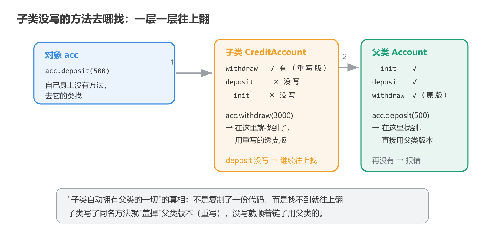

### 6.5.2　方法重写与 `super()`：一样的事，我有我的做法

子类可以**重写**（override）父类的方法——写个同名的，就把父类的盖掉了。信用卡取钱可以透支，储蓄账户不行：

```python
class Account:
    def __init__(self, owner, balance):
        self.owner = owner
        self.balance = balance

    def withdraw(self, amount):
        if amount > self.balance:
            print("余额不足")
            return
        self.balance -= amount

class CreditAccount(Account):
    def withdraw(self, amount):        # 重写：信用卡允许透支 5000
        if amount > self.balance + 5000:
            print("超出透支额度")
            return
        self.balance -= amount
```

如果子类想**在父类的基础上加点东西**（而不是完全盖掉），用 `super()` 先调父类的版本：

```python
class Account:
    def __init__(self, owner, balance):
        self.owner = owner
        self.balance = balance

    def withdraw(self, amount):
        if amount > self.balance:
            print("余额不足")
            return
        self.balance -= amount

class VIPAccount(Account):
    def __init__(self, owner, balance, level):
        super().__init__(owner, balance)     # 父类的出厂设置先做完
        self.level = level                   # 再加 VIP 特有的

vip = VIPAccount("小红", 2000, "黄金")
print(vip.owner, vip.balance, vip.level)     # 小红 2000 黄金
```

`super().__init__` 像一条装配线：父类的工序先做完，子类再加装自己的零件：

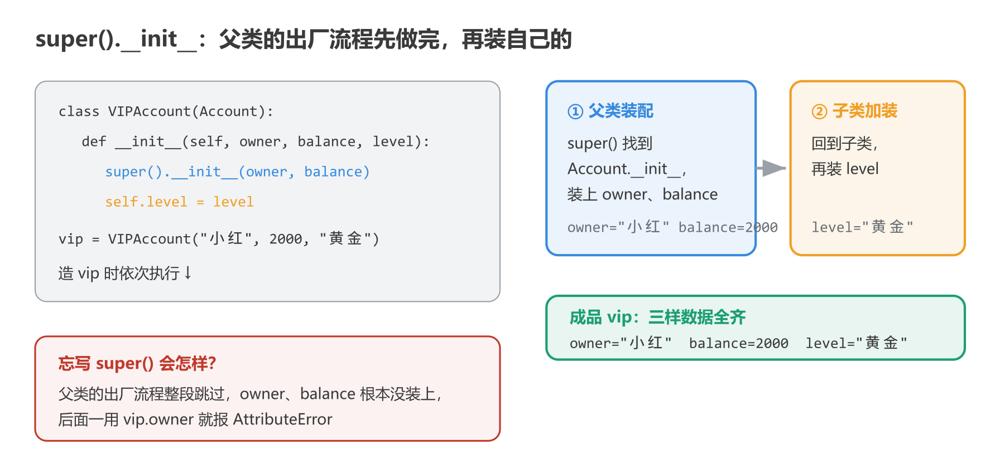

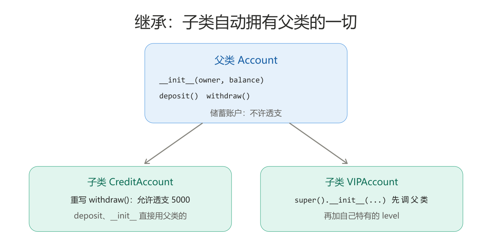

<sub>[返回目录](#top)</sub>

---

<a id="s66"></a>

## 6.6　多态：同一句话，各自理解

**多态 = 同一个指令，不同的对象各自用各自的方式执行。** 听着抽象，其实你天天在用：

```python
print(len([1, 2, 3]))     # 3：列表的 len
print(len("hello"))       # 5：字符串的 len
print(len({"a": 1}))      # 1：字典的 len
```

同样是 `len(...)`，列表、字符串、字典**各自有各自的算法**，但你根本不用关心——喊一句 `len`，对象自己知道该怎么办。这就是多态：调用方省心，对象各自负责。

**多态到底是怎么实现的？** 在 Python 里没有任何神秘机关，就两条：

1. 每个类**各自实现一个同名方法**；
2. 调用方**不判断类型**，直接喊这个方法名——对象拿到谁，就执行谁的版本。

拿 `len()` 拆开验证。`len(x)` 内部做的事情其实是：**去调用 `x.__len__()`**。列表、字符串、字典正是各自实现了自己的 `__len__`，所以 `len` 对它们全都管用。这个机制我们自己也能完整复刻——给自己的类写上 `__len__`，`len()` 就立刻认识我们的对象：

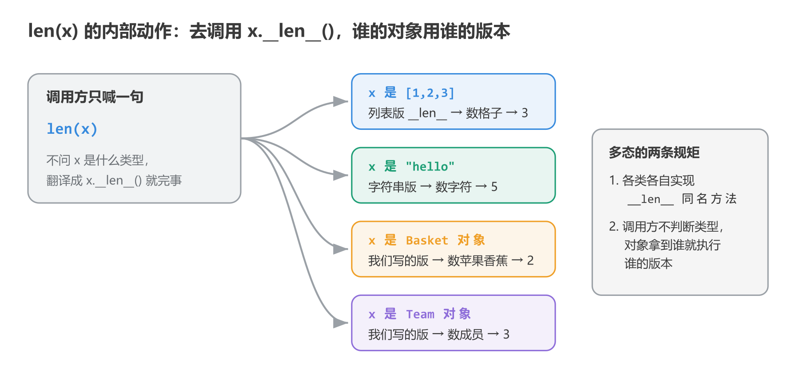

```python
class Basket:
    def __init__(self):
        self.items = []

    def put(self, item):
        self.items.append(item)

    def __len__(self):               # 告诉 len()：我的"长度"这么算
        return len(self.items)

class Team:
    def __init__(self, members):
        self.members = members

    def __len__(self):               # 同名方法，各自的算法
        return len(self.members)

b = Basket()
b.put("苹果")
b.put("香蕉")
t = Team(["小明", "小红", "小刚"])

print(len(b))     # 2：len(b) 实际调的是 b.__len__()
print(len(t))     # 3：len(t) 实际调的是 t.__len__()
```

走一遍 `len(b)`：Python 拿到 `b`，发现它是 `Basket`，就调用 `Basket` 里写的 `__len__`——返回 2。换成 `t`，就调用 `Team` 的版本。我们的类就这样加入了"`len` 可用俱乐部"，和内置的列表、字符串平起平坐。**这就是多态的完整闭环，也顺便提前看到了 6.7 魔术方法的威力。**

用我们自己的类再看一遍同样的机制。各种动物都会"叫"，但叫法不同：

```python
class Dog:
    def speak(self):
        print("汪汪")

class Cat:
    def speak(self):
        print("喵喵")

animals = [Dog(), Cat(), Dog()]
for a in animals:
    a.speak()     # 汪汪 / 喵喵 / 汪汪：同一句代码，各叫各的
```

同一行 `a.speak()` 跑三轮，每轮拿到谁就用谁的版本：

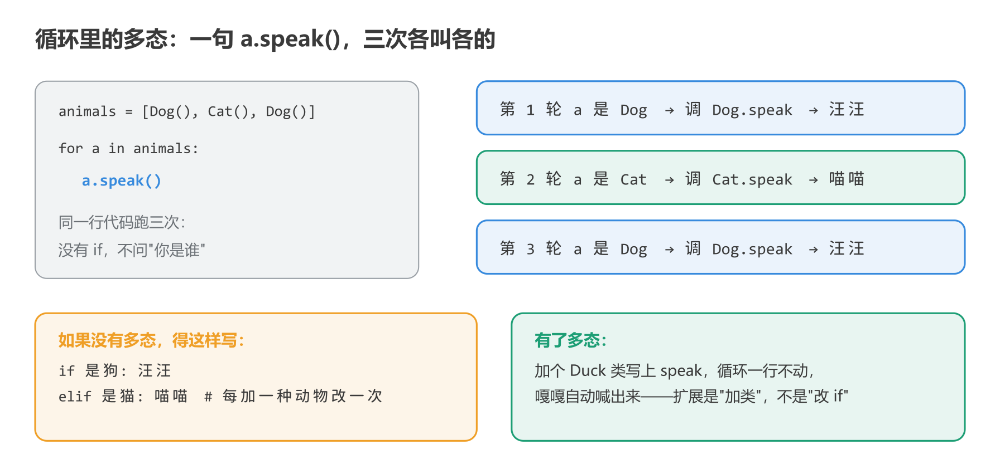

注意循环里那句 `a.speak()`：**不需要 if 判断"a 是狗还是猫"**——每个对象自己知道怎么 `speak`。多态的价值就在这里：

- **调用方代码不用改**：以后再来个 `Duck`，循环一行不动，`speak()` 照样喊得出来；
- **新增类型零成本**：扩展是"加一个新类"，不是"改一堆 if-else"。

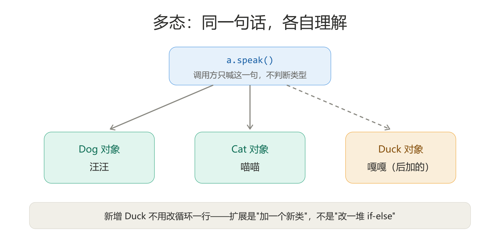

**三大特性到此收拢**：封装管"数据别乱碰"，继承管"代码别重写"，多态管"调用别判断"——三招都是为了让程序更好维护、更好扩展。这就是面向对象的思想内核。

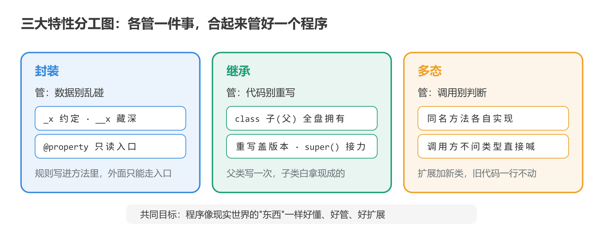

<sub>[返回目录](#top)</sub>

---

<a id="s67"></a>

## 6.7　魔术方法：`__str__` / `__repr__` / `__eq__`

类里那些**双下划线开头结尾的方法**叫魔术方法——你不直接调用它们，是 **Python 在特定时刻自动替你调用**。`__init__`（造对象时自动跑）就是最早见到的一个。再认识三个常用的：

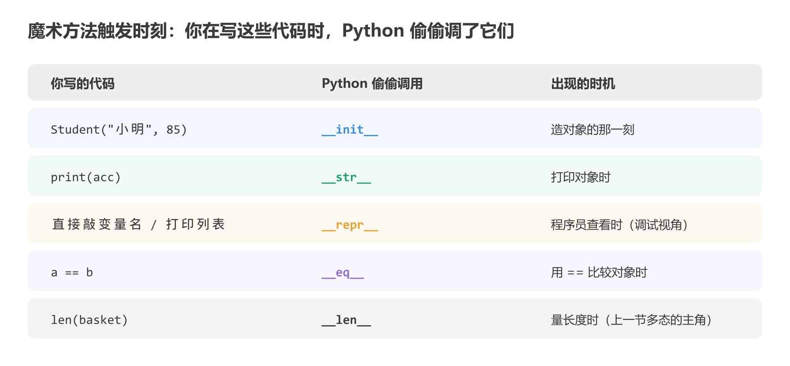

**`__str__`：`print(对象)` 时自动调用**，决定对象"打印出来长什么样"：

```python
class Account:
    def __init__(self, owner, balance):
        self.owner = owner
        self.balance = balance

    def __str__(self):
        return f"账户({self.owner}，余额{self.balance}元)"

acc = Account("小明", 1000)
print(acc)     # 账户(小明，余额1000元)：没有 __str__ 会打印 <__main__.Account object at 0x...>
```

**`__repr__`：给程序员看的"官方表示"**，在交互式环境直接敲对象名、或在列表里打印时用它。约定俗成的写法是"看起来像能再造出这个对象的代码"：

```python
class Account:
    def __init__(self, owner, balance):
        self.owner = owner
        self.balance = balance

    def __repr__(self):
        return f"Account({self.owner!r}, {self.balance})"

accounts = [Account("小明", 1000), Account("小红", 500)]
print(accounts)     # [Account('小明', 1000), Account('小红', 500)]
```

**`__eq__`：用 `==` 比较两个对象时自动调用**，决定"怎样算相等"：

```python
class Account:
    def __init__(self, owner, balance):
        self.owner = owner
        self.balance = balance

    def __eq__(self, other):
        return self.owner == other.owner     # 户主相同就算同一个账户

a = Account("小明", 1000)
b = Account("小明", 9999)
print(a == b)     # True：余额不同，但户主相同就算相等（规则自己定）
```

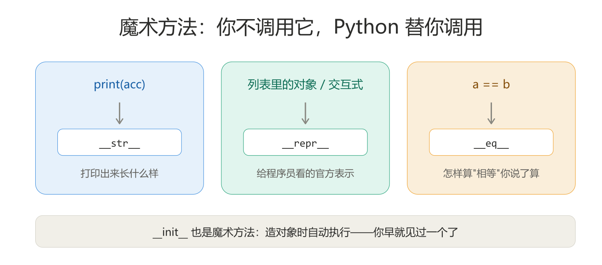

<sub>[返回目录](#top)</sub>

---

<a id="s68"></a>

## 6.8　实战：银行账户系统

综合运用本节内容。需求：能开户、存钱、取钱（不许透支）、查余额；透支要拦，打印账户要好看。

```python
class Account:
    def __init__(self, owner, balance=0):
        self.owner = owner
        self._balance = balance        # 内部数据：约定外面别直接碰

    # 查询只读入口
    @property
    def balance(self):
        return self._balance           # 查余额走这里（只读，不给写入口）

    # 存储
    def deposit(self, amount):
        if amount <= 0:
            print("存款金额必须大于 0")
            return
        self._balance += amount
        print(f"存入 {amount} 元，余额 {self._balance} 元")

    # 取出
    def withdraw(self, amount):
        if amount > self._balance:
            print(f"余额不足：当前余额 {self._balance} 元")
            return
        self._balance -= amount
        print(f"取出 {amount} 元，余额 {self._balance} 元")

    # 打印
    def __str__(self):
        return f"账户({self.owner}，余额{self._balance}元)"

acc = Account("小明", 1000)
print(acc)                # 账户(小明，余额1000元)
acc.deposit(500)          # 存入 500 元，余额 1500 元
acc.withdraw(2000)        # 余额不足：当前余额 1500 元
acc.withdraw(300)         # 取出 300 元，余额 1200 元
print(acc.balance)        # 1200（@property 只读入口）
# acc.balance = 0         # 报错：只读属性没有写入口，改不了
```

取 2000 被拦、取 300 放行，全过程走一遍：

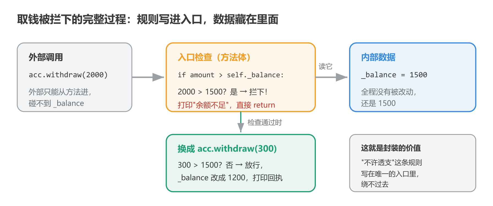

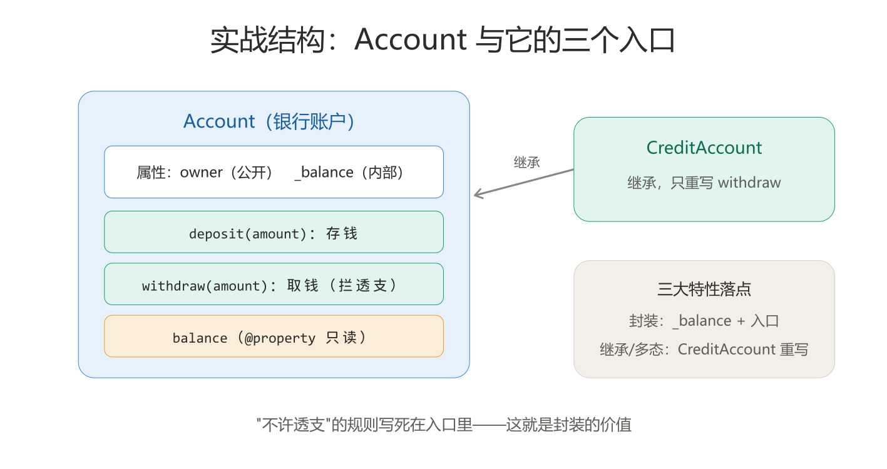

对照三大特性看这段代码：

- **封装**：`_balance` 按约定内部使用，外面只能走 `deposit` / `withdraw` / `balance` 三个入口，"不许透支"的规则写死在入口里；
- **继承**（扩展演示）：要加"信用卡账户"，一行 `class CreditAccount(Account)` 再重写 `withdraw` 即可，存款逻辑不用重抄；
- **多态**：以后如果有多种账户，`acc.withdraw(100)` 这行调用代码对所有账户通用——各自按各自规则执行。

```python
class Account:
    def __init__(self, owner, balance=0):
        self.owner = owner
        self._balance = balance        # 内部数据：约定外面别直接碰

    @property
    def balance(self):
        return self._balance           # 查余额走这里（只读，不给写入口）

    def deposit(self, amount):
        if amount <= 0:
            print("存款金额必须大于 0")
            return
        self._balance += amount
        print(f"存入 {amount} 元，余额 {self._balance} 元")

    def withdraw(self, amount):
        if amount > self._balance:
            print(f"余额不足：当前余额 {self._balance} 元")
            return
        self._balance -= amount
        print(f"取出 {amount} 元，余额 {self._balance} 元")

    def __str__(self):
        return f"账户({self.owner}，余额{self._balance}元)"

class CreditAccount(Account):
    def withdraw(self, amount):          # 重写：信用卡允许透支 5000
        if amount > self.balance + 5000:
            print("超出透支额度")
            return
        self._balance -= amount          # 子类属于"内部"，按约定可以用 _balance
        print(f"取出 {amount} 元，余额 {self._balance} 元")

credit = CreditAccount("小红", 1000)
credit.withdraw(3000)     # 取出 3000 元，余额 -2000 元（透支成功）
```

> 注意这里用单下划线 `_balance` 而不是双下划线的原因：双下划线会被改名成 `_Account__balance`，子类访问起来很别扭；单下划线的约定是"外部别碰，但自家人（含子类）可以用"——真实项目里需要子类访问的内部数据，通常就用单下划线。

> 本节配套代码见 [`code/part1_python/section6/`](../../code/part1_python/section6/)，也可以打开整节的交互式笔记本 [section6.ipynb](../../code/part1_python/section6/section6.ipynb)，边看讲解边逐格运行：
> [01_class_basics.py](../../code/part1_python/section6/01_class_basics.py)（类与对象/init/self）·
> [02_attributes.py](../../code/part1_python/section6/02_attributes.py)（实例属性/类属性）·
> [03_encapsulation.py](../../code/part1_python/section6/03_encapsulation.py)（封装）·
> [04_inheritance.py](../../code/part1_python/section6/04_inheritance.py)（继承与 super）·
> [05_polymorphism.py](../../code/part1_python/section6/05_polymorphism.py)（多态）·
> [06_magic.py](../../code/part1_python/section6/06_magic.py)（魔术方法）·
> [07_bank_account.py](../../code/part1_python/section6/07_bank_account.py)（银行账户实战）

<sub>[返回目录](#top)</sub>

---

<a id="summary"></a>

## 本节小结

**核心思想**

- 对象 = 数据（属性）+ 动作（方法）装进同一个东西；类是图纸，对象是实物。
- 三大特性：**封装**（数据藏好、只留安全入口）、**继承**（新类复用旧类）、**多态**（同一指令，各自执行）——都是为了让代码好维护、好扩展。

**类的写法**

- `__init__` 出厂设置；`self` 是"这个对象自己"，定义时必写、调用时自动填。
- 实例属性各带各的（`self.x`），类属性全类共用（类里直接写）；实例方法第一个参数是 `self`。

**三大特性落地**

- 封装：`_x` 约定别碰、`__x` 改名藏深、`@property` 留只读入口。
- 继承：`class 子(父)` 自动拥有父类一切；重写 = 同名覆盖；`super()` 先调父类版本。
- 多态：`len()` 对各种容器通用、循环里 `a.speak()` 不用判断类型——调用方省心，扩展零成本。
- 魔术方法：`__str__` 管 print、`__repr__` 管程序员视角、`__eq__` 管 `==`——都是 Python 自动调用。

下一节：文件读写与异常处理。

<sub>[返回目录](#top)</sub>
